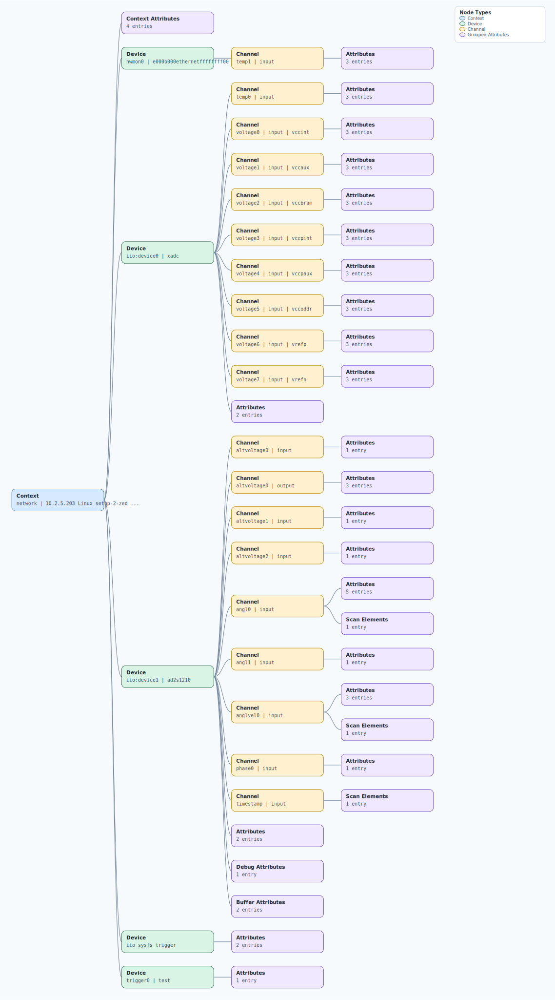

.. This file is auto-generated by doc/gen_emu_xml_trees.py.
   Do not edit manually.

Emulation Context: ad2s1210.xml
===============================

Source XML: ``test/emu/devices/ad2s1210.xml``

Diagram
-------

.. Note:: The diagram intentionally groups large attribute lists to keep
   the structure readable.

Text Preview
------------

.. code-block:: text

   context name=network description=10.2.5.203 Linux setup-2-zed 6.6.0-rc1-00159-gc9e4b991d8c1 #1 SMP PREEMPT Tue Sep 26 10:20:33 CDT 2023 armv7l
   |-- context-attribute name=hw_carrier value=Xilinx Zynq ZED
   |-- context-attribute name=ip,ip-addr value=10.2.5.203
   |-- context-attribute name=local,kernel value=6.6.0-rc1-00159-gc9e4b991d8c1
   |-- context-attribute name=uri value=ip:10.2.5.203
   |-- device id=hwmon0 name=e000b000ethernetffffffff00
   |   `-- channel id=temp1 type=input
   |       |-- attribute name=crit filename=temp1_crit value=100000
   |       |-- attribute name=input filename=temp1_input value=43000
   |       `-- attribute name=max_alarm filename=temp1_max_alarm value=0
   |-- device id=iio:device0 name=xadc
   |   |-- channel id=temp0 type=input
   |   |   |-- attribute name=offset filename=in_temp0_offset value=-2219
   |   |   |-- attribute name=raw filename=in_temp0_raw value=2624
   |   |   `-- attribute name=scale filename=in_temp0_scale value=123.040771484
   |   |-- channel id=voltage0 type=input name=vccint
   |   |   |-- attribute name=label filename=in_voltage0_vccint_label value=vccint
   |   |   |-- attribute name=raw filename=in_voltage0_vccint_raw value=1394
   |   |   `-- attribute name=scale filename=in_voltage0_vccint_scale value=0.732421875
   |   |-- channel id=voltage1 type=input name=vccaux
