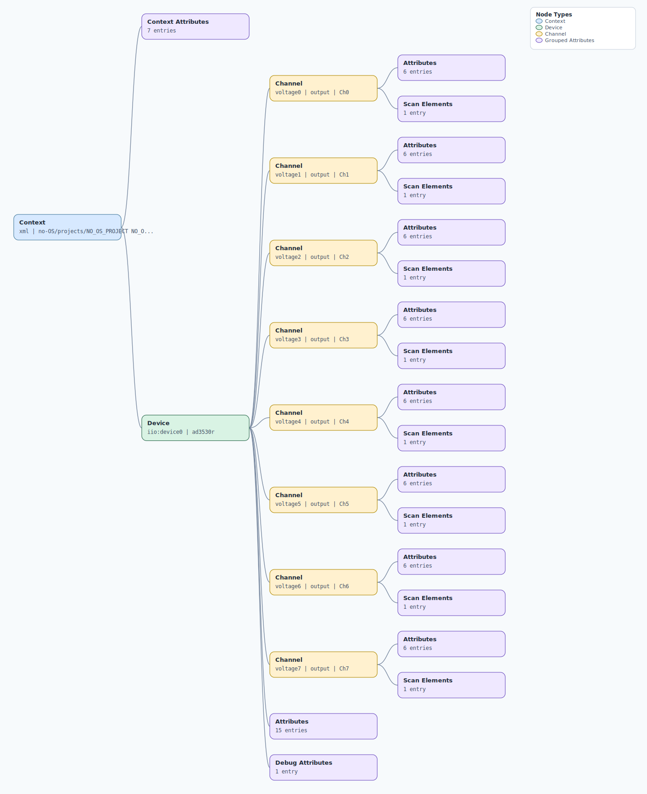

.. This file is auto-generated by doc/gen_emu_xml_trees.py.
   Do not edit manually.

Emulation Context: ad353xr.xml
==============================

Source XML: ``test/emu/devices/ad353xr.xml``

Diagram
-------

.. Note:: The diagram intentionally groups large attribute lists to keep
   the structure readable.

Text Preview
------------

.. code-block:: text

   context name=xml description=no-OS/projects/NO_OS_PROJECT NO_OS_VERSION
   |-- context-attribute name=fw_version value=6b3592a6adf
   |-- context-attribute name=hw_carrier value=SDP_K1
   |-- context-attribute name=hw_mezzanine value=EVAL-AD3530RARDZ
   |-- context-attribute name=hw_name value=EVAL-AD3530RARDZ
   |-- context-attribute name=serial,description value=ttyS0
   |-- context-attribute name=serial,port value=/dev/ttyS0
   |-- context-attribute name=uri value=serial:/dev/ttyS0,230400,8n1n
   `-- device id=iio:device0 name=ad3530r
       |-- channel id=voltage0 type=output name=Ch0
       |   |-- scan-element index=0 format=le:u16/16>>0
       |   |-- attribute name=input_register filename=out_voltage0_input_register value=0
       |   |-- attribute name=offset filename=out_voltage0_offset value=0
       |   |-- attribute name=operating_mode filename=out_voltage0_operating_mode value=32kOhm_to_gnd
       |   |-- attribute name=operating_mode_available filename=out_voltage0_operating_mode_available value=normal_operation 1kOhm_to_gnd 7k7Ohm_to_gnd 32kOhm_to_gnd
       |   |-- attribute name=raw filename=out_voltage0_raw value=0
       |   `-- attribute name=scale filename=out_voltage0_scale value=0.0381475538
       |-- channel id=voltage1 type=output name=Ch1
       |   |-- scan-element index=1 format=le:u16/16>>0
       |   |-- attribute name=input_register filename=out_voltage1_input_register value=0
