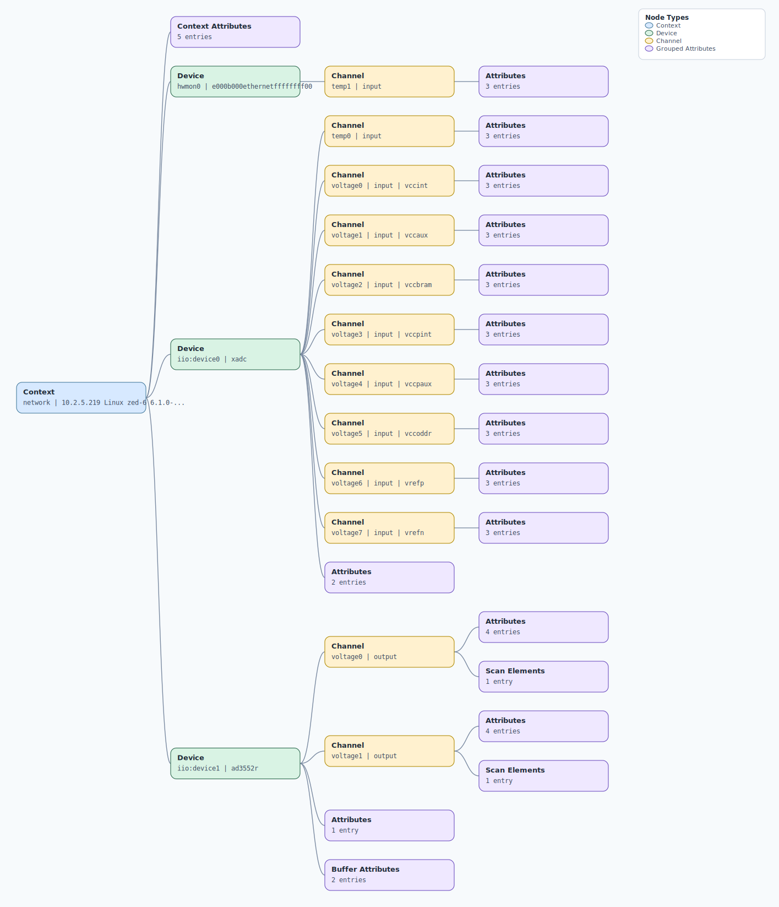

.. This file is auto-generated by doc/gen_emu_xml_trees.py.
   Do not edit manually.

Emulation Context: ad3552r.xml
==============================

Source XML: ``test/emu/devices/ad3552r.xml``

Diagram
-------

.. Note:: The diagram intentionally groups large attribute lists to keep
   the structure readable.

Text Preview
------------

.. code-block:: text

   context name=network description=10.2.5.219 Linux zed-6 6.1.0-xilinx-271662-gfbd2b84ac912-dirty #7 SMP PREEMPT Wed May 15 10:46:41 CEST 2024 armv7l
   |-- context-attribute name=hw_carrier value=Avnet ZedBoard board
   |-- context-attribute name=hw_model value=EVAL-AD3552RFMC1Z on Xilinx Zynq ZED
   |-- context-attribute name=ip,ip-addr value=10.2.5.219
   |-- context-attribute name=local,kernel value=6.1.0-xilinx-271662-gfbd2b84ac912-dirty
   |-- context-attribute name=uri value=ip:10.2.5.219
   |-- device id=hwmon0 name=e000b000ethernetffffffff00
   |   `-- channel id=temp1 type=input
   |       |-- attribute name=crit filename=temp1_crit value=100000
   |       |-- attribute name=input filename=temp1_input value=41000
   |       `-- attribute name=max_alarm filename=temp1_max_alarm value=0
   |-- device id=iio:device0 name=xadc
   |   |-- channel id=temp0 type=input
   |   |   |-- attribute name=offset filename=in_temp0_offset value=-2219
   |   |   |-- attribute name=raw filename=in_temp0_raw value=2614
   |   |   `-- attribute name=scale filename=in_temp0_scale value=123.040771484
   |   |-- channel id=voltage0 type=input name=vccint
   |   |   |-- attribute name=label filename=in_voltage0_vccint_label value=vccint
   |   |   |-- attribute name=raw filename=in_voltage0_vccint_raw value=1371
   |   |   `-- attribute name=scale filename=in_voltage0_vccint_scale value=0.732421875
