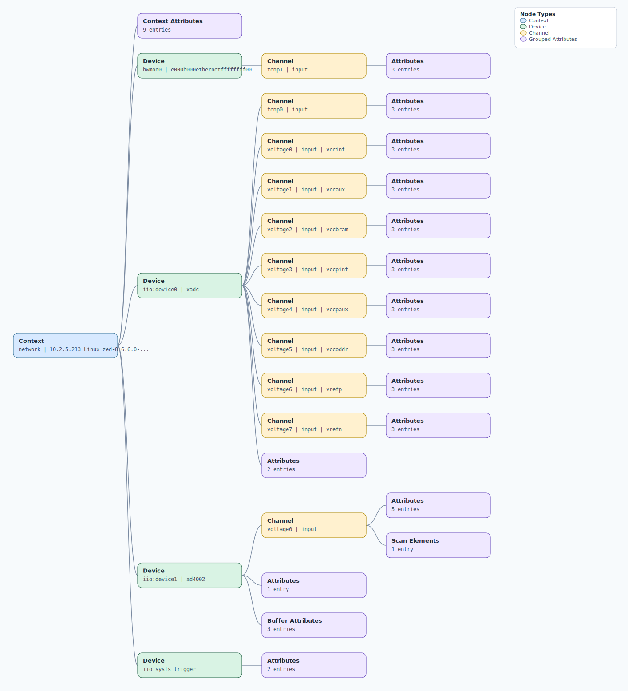

.. This file is auto-generated by doc/gen_emu_xml_trees.py.
   Do not edit manually.

Emulation Context: ad4002.xml
=============================

Source XML: ``test/emu/devices/ad4002.xml``

Diagram
-------

.. Note:: The diagram intentionally groups large attribute lists to keep
   the structure readable.

Text Preview
------------

.. code-block:: text

   context name=network description=10.2.5.213 Linux zed-8 6.6.0-ad4000-adi-24855-g9c953e02badc #1 SMP PREEMPT Fri Jan 24 11:54:39 EST 2025 armv7l
   |-- context-attribute name=hw_carrier value=Xilinx Zynq ZED
   |-- context-attribute name=hw_mezzanine value=EVAL-AD4002FMCZ
   |-- context-attribute name=hw_model value=EVAL-AD4002FMCZ on Xilinx Zynq ZED
   |-- context-attribute name=hw_name value=AD4002
   |-- context-attribute name=hw_serial value=Empty Field
   |-- context-attribute name=hw_vendor value=Analog Devices
   |-- context-attribute name=ip,ip-addr value=10.2.5.213
   |-- context-attribute name=local,kernel value=6.6.0-ad4000-adi-24855-g9c953e02badc
   |-- context-attribute name=uri value=ip:10.2.5.213
   |-- device id=hwmon0 name=e000b000ethernetffffffff00
   |   `-- channel id=temp1 type=input
   |       |-- attribute name=crit filename=temp1_crit value=100000
   |       |-- attribute name=input filename=temp1_input value=39000
   |       `-- attribute name=max_alarm filename=temp1_max_alarm value=0
   |-- device id=iio:device0 name=xadc
   |   |-- channel id=temp0 type=input
   |   |   |-- attribute name=offset filename=in_temp0_offset value=-2219
   |   |   |-- attribute name=raw filename=in_temp0_raw value=2594
   |   |   `-- attribute name=scale filename=in_temp0_scale value=123.040771484
