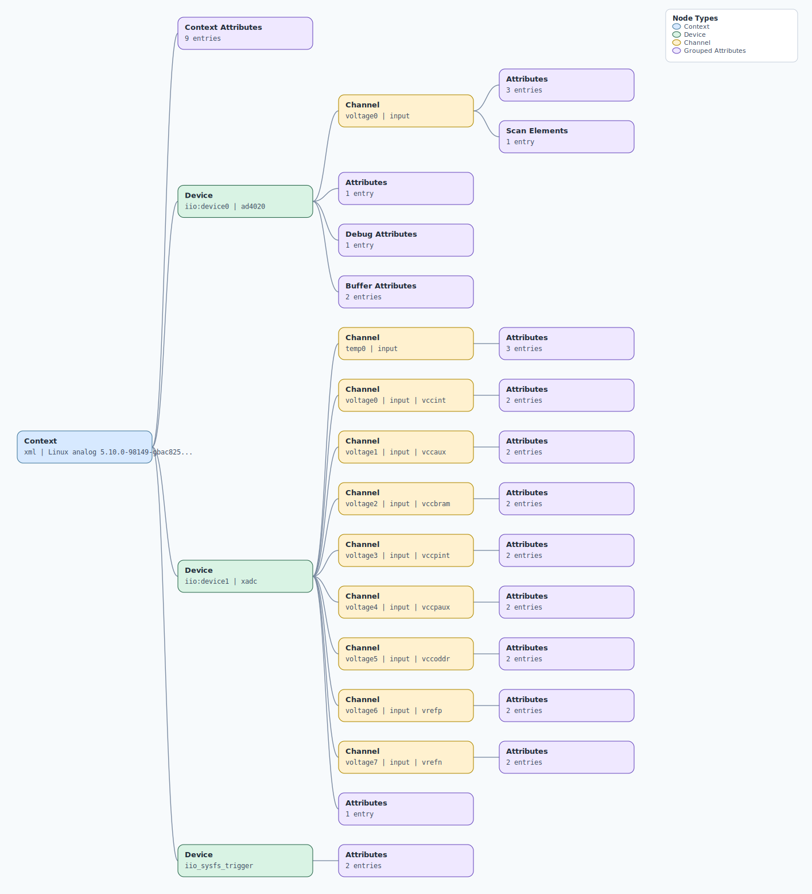

.. This file is auto-generated by doc/gen_emu_xml_trees.py.
   Do not edit manually.

Emulation Context: ad4020.xml
=============================

Source XML: ``test/emu/devices/ad4020.xml``

Diagram
-------

.. Note:: The diagram intentionally groups large attribute lists to keep
   the structure readable.

Text Preview
------------

.. code-block:: text

   context name=xml description=Linux analog 5.10.0-98149-gbac8254d25c0 #5916 SMP PREEMPT Thu Apr 7 06:51:55 IST 2022 armv7l
   |-- context-attribute name=hdl_system_id value=[ad40xx_fmc] [ad40xx: 1 - adc_sampling_rate: 1800000 - adc_resolution: 20] on [zed] git branch [master] git [fe713a5e98078976af3d745172afece0dd2b4910] clean [2022-04-01 22:31:08] UTC
   |-- context-attribute name=hw_carrier value=Xilinx Zynq ZED
   |-- context-attribute name=hw_mezzanine value=EVAL-AD4020FMCZ
   |-- context-attribute name=hw_model value=EVAL-AD4020FMCZ on Xilinx Zynq ZED
   |-- context-attribute name=hw_name value=AD4020
   |-- context-attribute name=hw_serial value=Empty Field
   |-- context-attribute name=hw_vendor value=Analog Devices
   |-- context-attribute name=local,kernel value=5.10.0-98149-gbac8254d25c0
   |-- context-attribute name=uri value=local:
   |-- device id=iio:device0 name=ad4020
   |   |-- channel id=voltage0 type=input
   |   |   |-- scan-element index=0 format=le:s20/32>>0 scale=0.002384
   |   |   |-- attribute name=offset filename=in_voltage0_offset
   |   |   |-- attribute name=raw filename=in_voltage0_raw
   |   |   `-- attribute name=scale filename=in_voltage0_scale
   |   |-- attribute name=sampling_frequency
   |   |-- debug-attribute name=direct_reg_access
   |   |-- buffer-attribute name=data_available
   |   `-- buffer-attribute name=length_align_bytes
