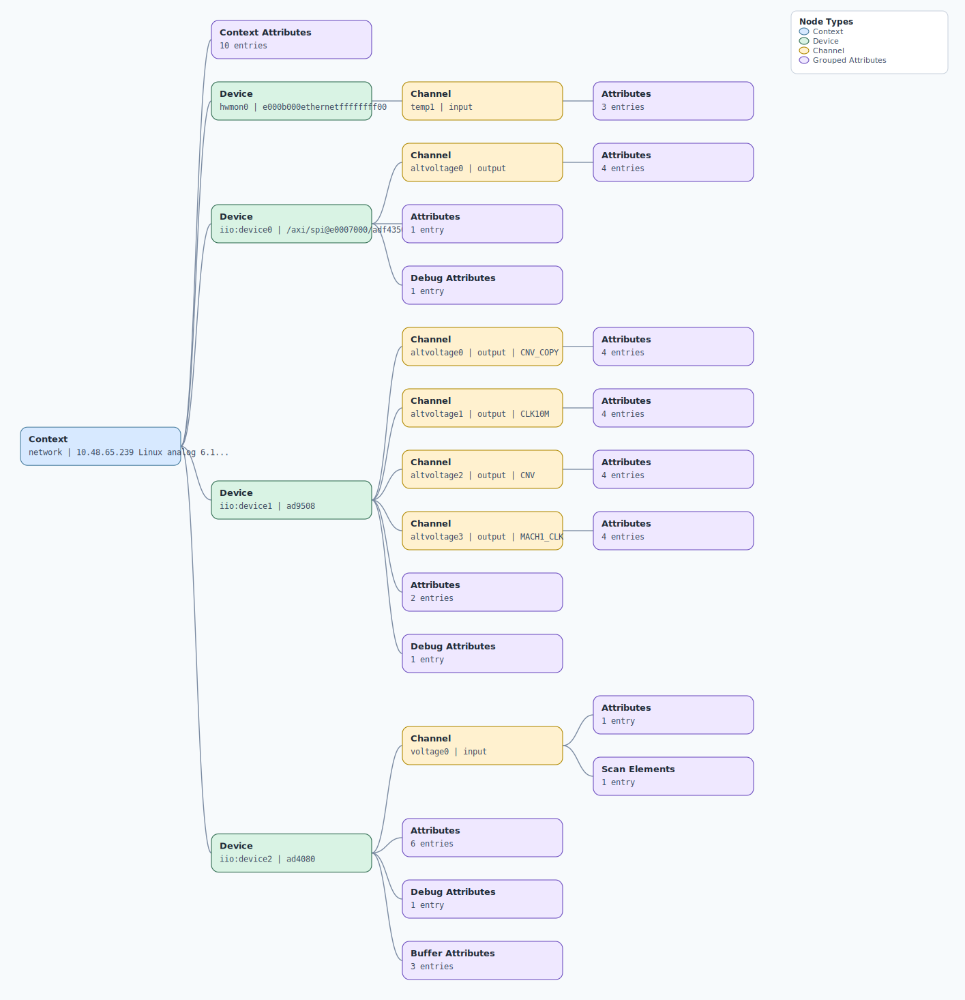

.. This file is auto-generated by doc/gen_emu_xml_trees.py.
   Do not edit manually.

Emulation Context: ad4080.xml
=============================

Source XML: ``test/emu/devices/ad4080.xml``

Diagram
-------

.. Note:: The diagram intentionally groups large attribute lists to keep
   the structure readable.

Text Preview
------------

.. code-block:: text

   context name=network description=10.48.65.239 Linux analog 6.15.0-rc1-00274-gf1bd9f3b3978 #258 SMP PREEMPT Tue May 20 14:37:17 EEST 2025 armv7l
   |-- context-attribute name=hdl_system_id value=[ad408x_fmc_evb] on [zed] git branch [dev_segura] git [97dda1eb9101a238f13f40991cd25452e6536611] dirty [2025-05-12 11:17:41] UTC
   |-- context-attribute name=hw_carrier value=Xilinx Zynq ZED
   |-- context-attribute name=hw_mezzanine value=EVAL-AD4080-FMCZ
   |-- context-attribute name=hw_model value=EVAL-AD4080-FMCZ on Xilinx Zynq ZED
   |-- context-attribute name=hw_name value=EVAL-AD4080-FMCZ
   |-- context-attribute name=hw_serial value=Empty Field
   |-- context-attribute name=hw_vendor value=Analog Devices
   |-- context-attribute name=ip,ip-addr value=10.48.65.239
   |-- context-attribute name=local,kernel value=6.15.0-rc1-00274-gf1bd9f3b3978
   |-- context-attribute name=uri value=ip:10.48.65.239
   |-- device id=hwmon0 name=e000b000ethernetffffffff00
   |   `-- channel id=temp1 type=input
   |       |-- attribute name=crit filename=temp1_crit value=100000
   |       |-- attribute name=input filename=temp1_input value=41000
   |       `-- attribute name=max_alarm filename=temp1_max_alarm value=0
   |-- device id=iio:device0 name=/axi/spi@e0007000/adf4350@1
   |   |-- channel id=altvoltage0 type=output
   |   |   |-- attribute name=frequency filename=out_altvoltage0_frequency value=400000000
   |   |   |-- attribute name=frequency_resolution filename=out_altvoltage0_frequency_resolution value=100000
