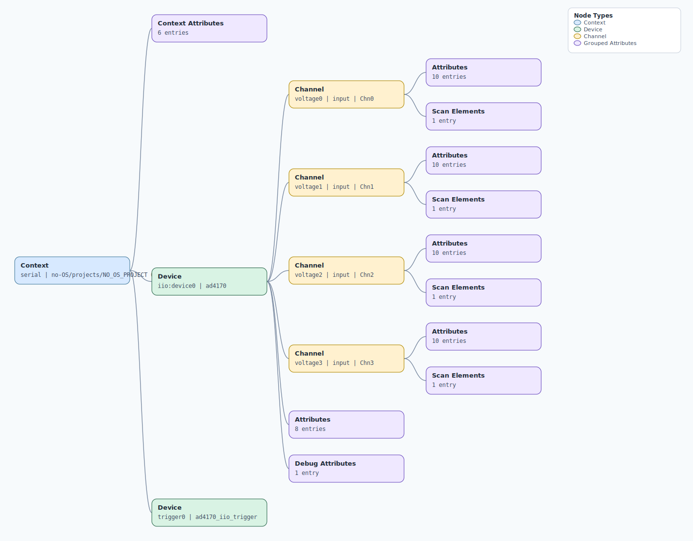

.. This file is auto-generated by doc/gen_emu_xml_trees.py.
   Do not edit manually.

Emulation Context: ad4170.xml
=============================

Source XML: ``test/emu/devices/ad4170.xml``

Diagram
-------

.. Note:: The diagram intentionally groups large attribute lists to keep
   the structure readable.

Text Preview
------------

.. code-block:: text

   context name=serial description=no-OS/projects/NO_OS_PROJECT 0.1
   |-- context-attribute name=hw_carrier value=SDP_K1
   |-- context-attribute name=hw_mezzanine value=EVAL-AD4170-ARDZ
   |-- context-attribute name=hw_name value=EVAL-AD4170-ARDZ
   |-- context-attribute name=serial,description value=ttyS0
   |-- context-attribute name=serial,port value=/dev/ttyS0
   |-- context-attribute name=uri value=serial:/dev/ttyS0,230400,8n1n
   |-- device id=iio:device0 name=ad4170
   |   |-- channel id=voltage0 type=input name=Chn0
   |   |   |-- scan-element index=0 format=le:s24/32>>0
   |   |   |-- attribute name=filter filename=in_voltage0_filter value=sinc5_avg
   |   |   |-- attribute name=filter_available filename=in_voltage0_filter_available value=sinc5_avg sinc5 sinc3
   |   |   |-- attribute name=fs filename=in_voltage0_fs value=16
   |   |   |-- attribute name=internal_calibration filename=in_voltage0_internal_calibration value=NA
   |   |   |-- attribute name=offset filename=in_voltage0_offset value=-16777215
   |   |   |-- attribute name=raw filename=in_voltage0_raw value=16749356
   |   |   |-- attribute name=ref_select filename=in_voltage0_ref_select value=refout_avss
   |   |   |-- attribute name=ref_select_available filename=in_voltage0_ref_select_available value=refin1p_refin1m refin2p_refin2m refout_avss avdd_avss
   |   |   |-- attribute name=scale filename=in_voltage0_scale value=0.0002980232
   |   |   `-- attribute name=system_calibration filename=in_voltage0_system_calibration value=NA
