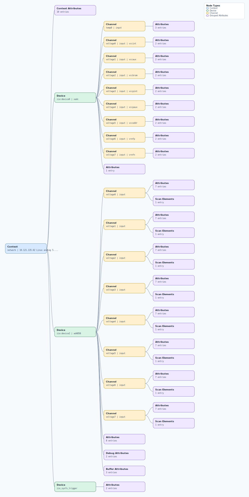

.. This file is auto-generated by doc/gen_emu_xml_trees.py.
   Do not edit manually.

Emulation Context: ad4858.xml
=============================

Source XML: ``test/emu/devices/ad4858.xml``

Diagram
-------

.. Note:: The diagram intentionally groups large attribute lists to keep
   the structure readable.

Text Preview
------------

.. code-block:: text

   context name=network description=10.121.135.62 Linux analog 5.10.0-98759-ga60a72f32cb9 #128 SMP PREEMPT Fri Jun 16 00:19:22 EEST 2023 armv7l
   |-- context-attribute name=ace,guid value=1958558906
   |-- context-attribute name=hdl_system_id value=[ad4858_fmcz] [LVDS_CMOS_N=0] on [zed] git branch [dev_ad4858_fmcz] git <cd5996e41695403f1c253c445ae4c232c08f857a> dirty [2023-06-12 15:43:01] UTC
   |-- context-attribute name=hw_carrier value=Xilinx Zynq ZED
   |-- context-attribute name=hw_mezzanine value=TESTCHIP_LTC2358
   |-- context-attribute name=hw_model value=TESTCHIP_LTC2358 on Xilinx Zynq ZED
   |-- context-attribute name=hw_name value=AD4858_TESTCHIP
   |-- context-attribute name=hw_vendor value=Analog Devices
   |-- context-attribute name=ip,ip-addr value=10.121.135.62
   |-- context-attribute name=local,kernel value=5.10.0-98759-ga60a72f32cb9
   |-- context-attribute name=uri value=ip:10.121.135.62
   |-- device id=iio:device0 name=xadc
   |   |-- channel id=temp0 type=input
   |   |   |-- attribute name=offset filename=in_temp0_offset value=-2219
   |   |   |-- attribute name=raw filename=in_temp0_raw value=2585
   |   |   `-- attribute name=scale filename=in_temp0_scale value=123.040771484
   |   |-- channel id=voltage0 type=input name=vccint
   |   |   |-- attribute name=raw filename=in_voltage0_vccint_raw value=1371
   |   |   `-- attribute name=scale filename=in_voltage0_vccint_scale value=0.732421875
   |   |-- channel id=voltage1 type=input name=vccaux
