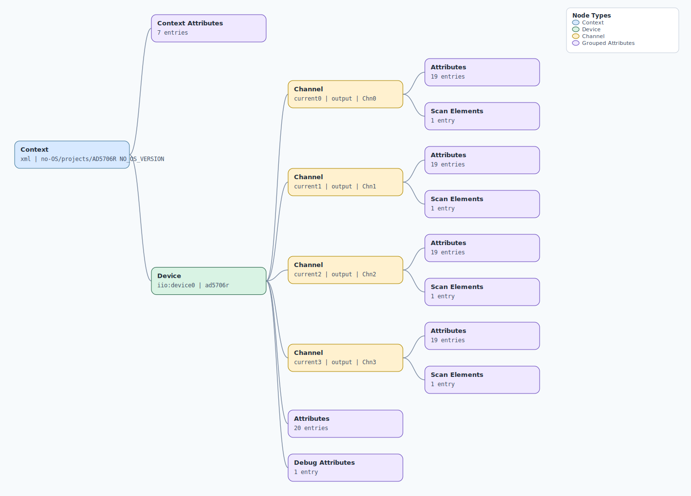

.. This file is auto-generated by doc/gen_emu_xml_trees.py.
   Do not edit manually.

Emulation Context: ad5706r.xml
==============================

Source XML: ``test/emu/devices/ad5706r.xml``

Diagram
-------

.. Note:: The diagram intentionally groups large attribute lists to keep
   the structure readable.

Text Preview
------------

.. code-block:: text

   context name=xml description=no-OS/projects/AD5706R NO_OS_VERSION
   |-- context-attribute name=fw_version value=v1.0.0
   |-- context-attribute name=hw_carrier value=SDP_K1
   |-- context-attribute name=hw_mezzanine value=EVAL-AD5706R-ARDZ
   |-- context-attribute name=hw_name value=EVAL-AD5706R-ARDZ
   |-- context-attribute name=serial,description value=ttyS0
   |-- context-attribute name=serial,port value=/dev/ttyS0
   |-- context-attribute name=uri value=serial:/dev/ttyS0,230400,8n1n
   `-- device id=iio:device0 name=ad5706r
       |-- channel id=current0 type=output name=Chn0
       |   |-- scan-element index=0 format=le:u16/16>>0
       |   |-- attribute name=hw_active_edge filename=out_current0_hw_active_edge value=rising_edge
       |   |-- attribute name=hw_active_edge_available filename=out_current0_hw_active_edge_available value=rising_edge falling_edge any_edge
       |   |-- attribute name=hw_func_sel filename=out_current0_hw_func_sel value=None
       |   |-- attribute name=hw_func_sel_available filename=out_current0_hw_func_sel_available value=None LDAC Toggle Dither
       |   |-- attribute name=input_register_a filename=out_current0_input_register_a value=0
       |   |-- attribute name=input_register_b filename=out_current0_input_register_b value=0
       |   |-- attribute name=ldac_trigger_chn filename=out_current0_ldac_trigger_chn value=None
       |   |-- attribute name=ldac_trigger_chn_available filename=out_current0_ldac_trigger_chn_available value=None sw_ldac hw_ldac
       |   |-- attribute name=multi_dac_sel_ch filename=out_current0_multi_dac_sel_ch value=exclude
