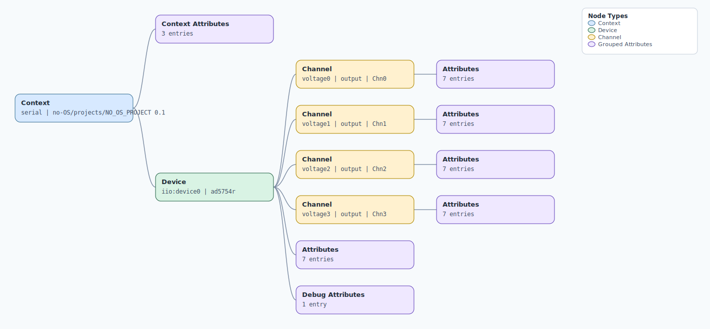

.. This file is auto-generated by doc/gen_emu_xml_trees.py.
   Do not edit manually.

Emulation Context: ad5754r.xml
==============================

Source XML: ``test/emu/devices/ad5754r.xml``

Diagram
-------

.. Note:: The diagram intentionally groups large attribute lists to keep
   the structure readable.

Text Preview
------------

.. code-block:: text

   context name=serial description=no-OS/projects/NO_OS_PROJECT 0.1
   |-- context-attribute name=serial,description value=ttyS0
   |-- context-attribute name=serial,port value=/dev/ttyS0
   |-- context-attribute name=uri value=serial:/dev/ttyS0,230400,8n1n
   `-- device id=iio:device0 name=ad5754r
       |-- channel id=voltage0 type=output name=Chn0
       |   |-- attribute name=offset filename=out_voltage0_offset value=0
       |   |-- attribute name=powerup filename=out_voltage0_powerup value=powerdown
       |   |-- attribute name=powerup_available filename=out_voltage0_powerup_available value=powerdown powerup
       |   |-- attribute name=range filename=out_voltage0_range value=0v_to_5v
       |   |-- attribute name=range_available filename=out_voltage0_range_available value=0v_to_5v 0v_to_10v 0v_to_10v8 neg5v_to_5v neg10v_to_10v neg10v8_to_10v8
       |   |-- attribute name=raw filename=out_voltage0_raw value=0
       |   `-- attribute name=scale filename=out_voltage0_scale value=0.0000762939
       |-- channel id=voltage1 type=output name=Chn1
       |   |-- attribute name=offset filename=out_voltage1_offset value=0
       |   |-- attribute name=powerup filename=out_voltage1_powerup value=powerdown
       |   |-- attribute name=powerup_available filename=out_voltage1_powerup_available value=powerdown powerup
       |   |-- attribute name=range filename=out_voltage1_range value=0v_to_5v
       |   |-- attribute name=range_available filename=out_voltage1_range_available value=0v_to_5v 0v_to_10v 0v_to_10v8 neg5v_to_5v neg10v_to_10v neg10v8_to_10v8
       |   |-- attribute name=raw filename=out_voltage1_raw value=0
