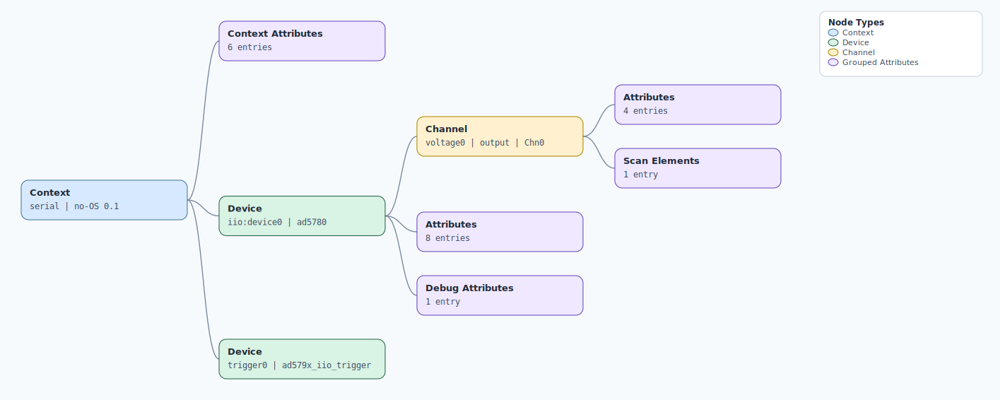

.. This file is auto-generated by doc/gen_emu_xml_trees.py.
   Do not edit manually.

Emulation Context: ad579x.xml
=============================

Source XML: ``test/emu/devices/ad579x.xml``

Diagram
-------

.. Note:: The diagram intentionally groups large attribute lists to keep
   the structure readable.

Text Preview
------------

.. code-block:: text

   context name=serial description=no-OS 0.1
   |-- context-attribute name=hw_carrier value=SDP_K1
   |-- context-attribute name=hw_mezzanine value=EVAL-AD5780ARDZ
   |-- context-attribute name=hw_name value=DAC
   |-- context-attribute name=serial,description value=ttyS0
   |-- context-attribute name=serial,port value=/dev/ttyS0
   |-- context-attribute name=uri value=serial:/dev/ttyS0,230400,8n1n
   |-- device id=iio:device0 name=ad5780
   |   |-- channel id=voltage0 type=output name=Chn0
   |   |   |-- scan-element index=0 format=le:s18/32>>0
   |   |   |-- attribute name=offset filename=out_voltage0_offset value=-262143
   |   |   |-- attribute name=powerdown filename=out_voltage0_powerdown value=1
   |   |   |-- attribute name=raw filename=out_voltage0_raw value=131072
   |   |   `-- attribute name=scale filename=out_voltage0_scale value=  0.076294
   |   |-- attribute name=clear_code value=0
   |   |-- attribute name=code_select value=2s_complement
   |   |-- attribute name=code_select_available value=2s_complement offset_binary
   |   |-- attribute name=output_amplifier value=unity_gain_mode
   |   |-- attribute name=output_amplifier_available value=gain_of_two unity_gain_mode
   |   |-- attribute name=powerdown_mode value=three_state
