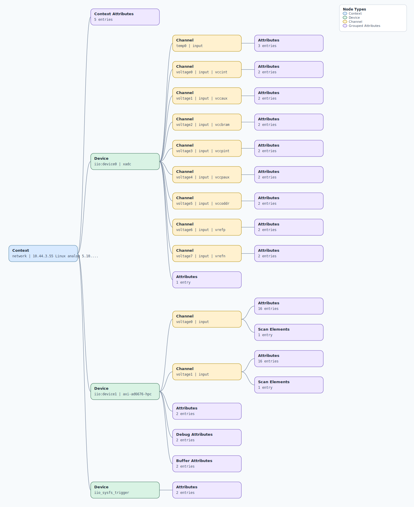

.. This file is auto-generated by doc/gen_emu_xml_trees.py.
   Do not edit manually.

Emulation Context: ad6676.xml
=============================

Source XML: ``test/emu/devices/ad6676.xml``

Diagram
-------

.. Note:: The diagram intentionally groups large attribute lists to keep
   the structure readable.

Text Preview
------------

.. code-block:: text

   context name=network description=10.44.3.55 Linux analog 5.10.0-14753-g5d8cec97b173 #406 SMP PREEMPT Wed Feb 1 15:28:48 CET 2023 armv7l
   |-- context-attribute name=hdl_system_id value=[ad6676evb] on [zc706] git branch [hdl_2021_r2] git [a07cec4a84a90769270711557a535147daf78ba5] clean [2022-10-21 01:38:54] UTC
   |-- context-attribute name=hw_carrier value=Xilinx Zynq ZC706
   |-- context-attribute name=ip,ip-addr value=10.44.3.55
   |-- context-attribute name=local,kernel value=5.10.0-14753-g5d8cec97b173
   |-- context-attribute name=uri value=ip:analog.local
   |-- device id=iio:device0 name=xadc
   |   |-- channel id=temp0 type=input
   |   |   |-- attribute name=offset filename=in_temp0_offset value=-2219
   |   |   |-- attribute name=raw filename=in_temp0_raw value=2495
   |   |   `-- attribute name=scale filename=in_temp0_scale value=123.040771484
   |   |-- channel id=voltage0 type=input name=vccint
   |   |   |-- attribute name=raw filename=in_voltage0_vccint_raw value=1369
   |   |   `-- attribute name=scale filename=in_voltage0_vccint_scale value=0.732421875
   |   |-- channel id=voltage1 type=input name=vccaux
   |   |   |-- attribute name=raw filename=in_voltage1_vccaux_raw value=2451
   |   |   `-- attribute name=scale filename=in_voltage1_vccaux_scale value=0.732421875
   |   |-- channel id=voltage2 type=input name=vccbram
   |   |   |-- attribute name=raw filename=in_voltage2_vccbram_raw value=1367
   |   |   `-- attribute name=scale filename=in_voltage2_vccbram_scale value=0.732421875
