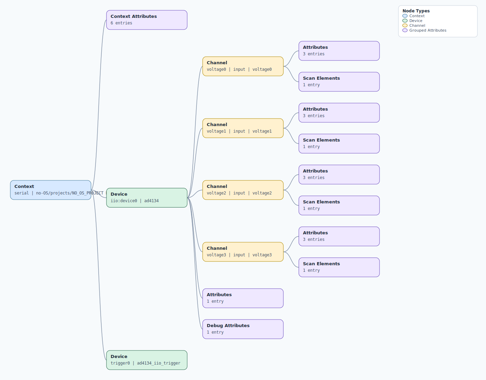

.. This file is auto-generated by doc/gen_emu_xml_trees.py.
   Do not edit manually.

Emulation Context: ad7134.xml
=============================

Source XML: ``test/emu/devices/ad7134.xml``

Diagram
-------

.. Note:: The diagram intentionally groups large attribute lists to keep
   the structure readable.

Text Preview
------------

.. code-block:: text

   context name=serial description=no-OS/projects/NO_OS_PROJECT NO_OS_VERSION
   |-- context-attribute name=hw_carrier value=NUCLEO_H563ZI
   |-- context-attribute name=hw_mezzanine value=EVAL-CN0561-ARDZ
   |-- context-attribute name=hw_name value=EVAL-CN0561-ARDZ
   |-- context-attribute name=serial,description value=ttyS0
   |-- context-attribute name=serial,port value=/dev/ttyS0
   |-- context-attribute name=uri value=serial:/dev/ttyS0,230400,8n1n
   |-- device id=iio:device0 name=ad4134
   |   |-- channel id=voltage0 type=input name=voltage0
   |   |   |-- scan-element index=0 format=le:U16/16>>0
   |   |   |-- attribute name=offset filename=in_voltage0_offset value=-65535
   |   |   |-- attribute name=raw filename=in_voltage0_raw value=61820
   |   |   `-- attribute name=scale filename=in_voltage0_scale value=ERROR
   |   |-- channel id=voltage1 type=input name=voltage1
   |   |   |-- scan-element index=1 format=le:U16/16>>0
   |   |   |-- attribute name=offset filename=in_voltage1_offset value=0
   |   |   |-- attribute name=raw filename=in_voltage1_raw value=24343
   |   |   `-- attribute name=scale filename=in_voltage1_scale value=ERROR
   |   |-- channel id=voltage2 type=input name=voltage2
   |   |   |-- scan-element index=2 format=le:U16/16>>0
