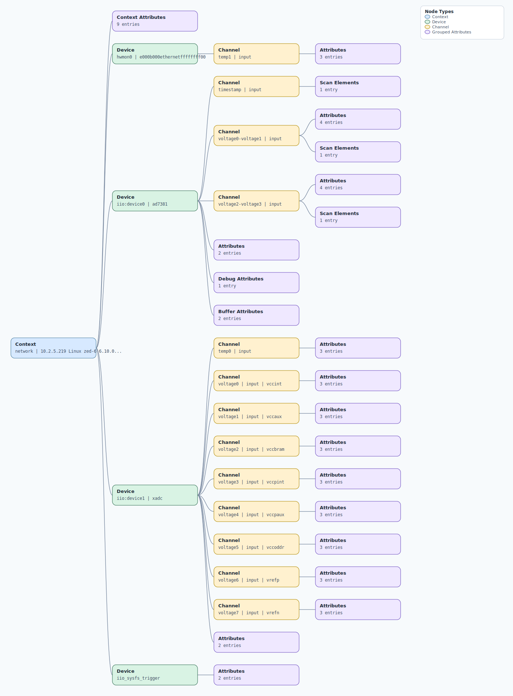

.. This file is auto-generated by doc/gen_emu_xml_trees.py.
   Do not edit manually.

Emulation Context: ad7381.xml
=============================

Source XML: ``test/emu/devices/ad7381.xml``

Diagram
-------

.. Note:: The diagram intentionally groups large attribute lists to keep
   the structure readable.

Text Preview
------------

.. code-block:: text

   context name=network description=10.2.5.219 Linux zed-6 6.10.0-rc6-ad7380x-mainline-g16279534cc5c-dirty #274 SMP PREEMPT Mon Jul 15 16:41:27 CEST 2024 armv7l
   |-- context-attribute name=hw_carrier value=Xilinx Zynq ZED
   |-- context-attribute name=hw_mezzanine value=EVAL-AD7383FMCZ
   |-- context-attribute name=hw_model value=EVAL-AD7383FMCZ on Xilinx Zynq ZED
   |-- context-attribute name=hw_name value=AD7383
   |-- context-attribute name=hw_serial value=6065780000000087
   |-- context-attribute name=hw_vendor value=Analog Devices
   |-- context-attribute name=ip,ip-addr value=10.2.5.219
   |-- context-attribute name=local,kernel value=6.10.0-rc6-ad7380x-mainline-g16279534cc5c-dirty
   |-- context-attribute name=uri value=ip:10.2.5.219
   |-- device id=hwmon0 name=e000b000ethernetffffffff00
   |   `-- channel id=temp1 type=input
   |       |-- attribute name=crit filename=temp1_crit value=100000
   |       |-- attribute name=input filename=temp1_input value=44000
   |       `-- attribute name=max_alarm filename=temp1_max_alarm value=0
   |-- device id=iio:device0 name=ad7381
   |   |-- channel id=timestamp type=input
   |   |   `-- scan-element index=2 format=le:S64/64>>0
   |   |-- channel id=voltage0-voltage1 type=input
   |   |   |-- scan-element index=0 format=le:s14/16>>0 scale=0.402832
