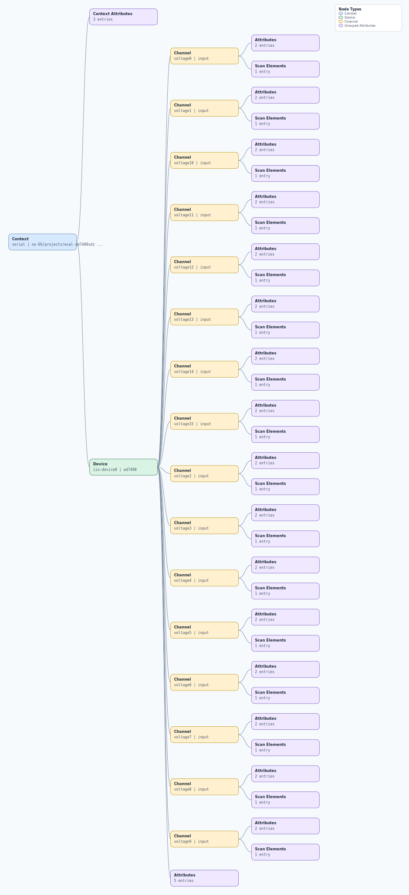

.. This file is auto-generated by doc/gen_emu_xml_trees.py.
   Do not edit manually.

Emulation Context: ad7490.xml
=============================

Source XML: ``test/emu/devices/ad7490.xml``

Diagram
-------

.. Note:: The diagram intentionally groups large attribute lists to keep
   the structure readable.

Text Preview
------------

.. code-block:: text

   context name=serial description=no-OS/projects/eval-ad7490sdz staging/ad7940-3c1f72f30
   |-- context-attribute name=serial,description value=DAPLink CMSIS-DAP - 04261702f0edc84c00000000000000000000000097969906
   |-- context-attribute name=serial,port value=/dev/ttyACM0
   |-- context-attribute name=uri value=serial:/dev/ttyACM0,57600,8n1n
   `-- device id=iio:device0 name=ad7490
       |-- channel id=voltage0 type=input
       |   |-- scan-element index=0 format=le:u12/16>>0
       |   |-- attribute name=raw filename=in_voltage0_raw value=0
       |   `-- attribute name=scale filename=in_voltage0_scale value=0.610351562
       |-- channel id=voltage1 type=input
       |   |-- scan-element index=1 format=le:u12/16>>0
       |   |-- attribute name=raw filename=in_voltage1_raw value=0
       |   `-- attribute name=scale filename=in_voltage1_scale value=0.610351562
       |-- channel id=voltage10 type=input
       |   |-- scan-element index=10 format=le:u12/16>>0
       |   |-- attribute name=raw filename=in_voltage10_raw value=0
       |   `-- attribute name=scale filename=in_voltage10_scale value=0.610351562
       |-- channel id=voltage11 type=input
       |   |-- scan-element index=11 format=le:u12/16>>0
       |   |-- attribute name=raw filename=in_voltage11_raw value=0
