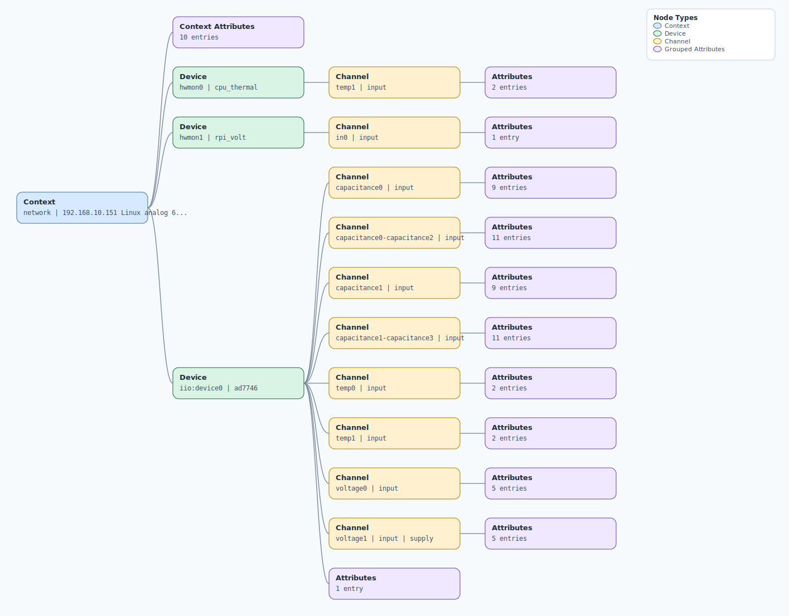

.. This file is auto-generated by doc/gen_emu_xml_trees.py.
   Do not edit manually.

Emulation Context: ad7746.xml
=============================

Source XML: ``test/emu/devices/ad7746.xml``

Diagram
-------

.. Note:: The diagram intentionally groups large attribute lists to keep
   the structure readable.

Text Preview
------------

.. code-block:: text

   context name=network description=192.168.10.151 Linux analog 6.1.54-v7l+ #1 SMP Mon Aug  5 09:24:25 UTC 2024 armv7l
   |-- context-attribute name=dtoverlay value=vc4-kms-v3d,rpi-cn0552
   |-- context-attribute name=hw_carrier value=Raspberry Pi 4 Model B Rev 1.1
   |-- context-attribute name=hw_mezzanine value=0x0001
   |-- context-attribute name=hw_model value=0x0001 on Raspberry Pi 4 Model B Rev 1.1
   |-- context-attribute name=hw_name value=PMD-RPI-INTZ
   |-- context-attribute name=hw_serial value=1eff9747-601b-4b3b-bc02-97c7fc0b6904
   |-- context-attribute name=hw_vendor value=Analog Devices, Inc.
   |-- context-attribute name=ip,ip-addr value=192.168.10.151
   |-- context-attribute name=local,kernel value=6.1.54-v7l+
   |-- context-attribute name=uri value=ip:192.168.10.151
   |-- device id=hwmon0 name=cpu_thermal
   |   `-- channel id=temp1 type=input
   |       |-- attribute name=crit filename=temp1_crit value=110000
   |       `-- attribute name=input filename=temp1_input value=42842
   |-- device id=hwmon1 name=rpi_volt
   |   `-- channel id=in0 type=input
   |       `-- attribute name=lcrit_alarm filename=in0_lcrit_alarm value=0
   `-- device id=iio:device0 name=ad7746
       |-- channel id=capacitance0 type=input
