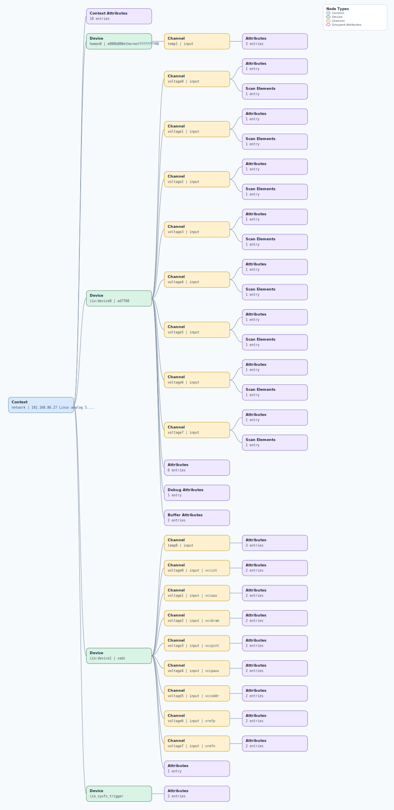

.. This file is auto-generated by doc/gen_emu_xml_trees.py.
   Do not edit manually.

Emulation Context: ad7768.xml
=============================

Source XML: ``test/emu/devices/ad7768.xml``

Diagram
-------

.. Note:: The diagram intentionally groups large attribute lists to keep
   the structure readable.

Text Preview
------------

.. code-block:: text

   context name=network description=192.168.86.27 Linux analog 5.10.0-98699-gb2da1fe4a96a #637 SMP PREEMPT Fri Dec 16 07:03:14 EET 2022 armv7l
   |-- context-attribute name=hdl_system_id value=[ad7768evb] on [zed] git branch [hdl_2021_r2] git [a07cec4a84a90769270711557a535147daf78ba5] clean [2022-10-20 19:22:27] UTC
   |-- context-attribute name=hw_carrier value=Xilinx Zynq ZED
   |-- context-attribute name=hw_mezzanine value=EVAL-AD7768FMCZ
   |-- context-attribute name=hw_model value=EVAL-AD7768FMCZ on Xilinx Zynq ZED
   |-- context-attribute name=hw_name value=AD7768
   |-- context-attribute name=hw_serial value=Empty Field
   |-- context-attribute name=hw_vendor value=Analog Devices
   |-- context-attribute name=ip,ip-addr value=192.168.86.27
   |-- context-attribute name=local,kernel value=5.10.0-98699-gb2da1fe4a96a
   |-- context-attribute name=uri value=ip:analog.local
   |-- device id=hwmon0 name=e000b000ethernetffffffff00
   |   `-- channel id=temp1 type=input
   |       |-- attribute name=crit filename=temp1_crit value=100000
   |       |-- attribute name=input filename=temp1_input value=31000
   |       `-- attribute name=max_alarm filename=temp1_max_alarm value=0
   |-- device id=iio:device0 name=ad7768
   |   |-- channel id=voltage0 type=input
   |   |   |-- scan-element index=0 format=le:s24/32>>0 scale=0.000488
   |   |   `-- attribute name=scale filename=in_voltage_scale value=0.000488281
