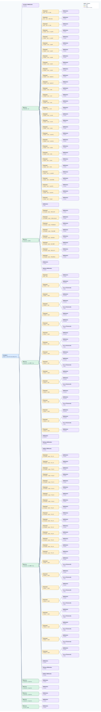

.. This file is auto-generated by doc/gen_emu_xml_trees.py.
   Do not edit manually.

Emulation Context: ad9081.xml
=============================

Source XML: ``test/emu/devices/ad9081.xml``

Diagram
-------

.. Note:: The diagram intentionally groups large attribute lists to keep
   the structure readable.

Text Preview
------------

.. code-block:: text

   context name=network description=10.44.3.53 Linux analog 5.10.0-14418-g81f4e14799e4-dirty #2904 SMP Thu Apr 14 17:34:27 CEST 2022 aarch64
   |-- context-attribute name=hdl_system_id value=[ad9081_fmca_ebz] on [zcu102] git branch [dev_mxfe_sync_cmos] git [d2f0dac0b13fff5f0d8c3699d974d07da2b2161c] clean [2022-03-25 08:48:37] UTC
   |-- context-attribute name=hw_carrier value=ZynqMP ZCU102 Rev1.0
   |-- context-attribute name=hw_mezzanine value=AD9081-FMCA-EBZ-A3
   |-- context-attribute name=hw_model value=AD9081-FMCA-EBZ-A3 on ZynqMP ZCU102 Rev1.0
   |-- context-attribute name=hw_name value=AD9081
   |-- context-attribute name=hw_serial value=Empty Field
   |-- context-attribute name=hw_vendor value=Analog Devices
   |-- context-attribute name=ip,ip-addr value=10.44.3.53
   |-- context-attribute name=local,kernel value=5.10.0-14418-g81f4e14799e4-dirty
   |-- context-attribute name=unique_id value=0ad9040001f6ff0f009e90a67dfd
   |-- context-attribute name=uri value=ip:analog.local
   |-- device id=iio:device0 name=ams
   |   |-- channel id=temp0 type=input name=ps_temp
   |   |   |-- attribute name=offset filename=in_temp0_ps_temp_offset value=-36058
   |   |   |-- attribute name=raw filename=in_temp0_ps_temp_raw value=41448
   |   |   `-- attribute name=scale filename=in_temp0_ps_temp_scale value=7.771514892
   |   |-- channel id=temp1 type=input name=remote_temp
   |   |   |-- attribute name=offset filename=in_temp1_remote_temp_offset value=-36058
   |   |   |-- attribute name=raw filename=in_temp1_remote_temp_raw value=41386
