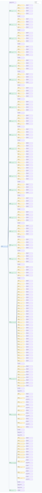

.. This file is auto-generated by doc/gen_emu_xml_trees.py.
   Do not edit manually.

Emulation Context: ad9081_full_bw_mock.xml
==========================================

Source XML: ``test/emu/devices/ad9081_full_bw_mock.xml``

Diagram
-------

.. Note:: The diagram intentionally groups large attribute lists to keep
   the structure readable.

Text Preview
------------

.. code-block:: text

   context name=network description=10.44.3.54 Linux analog 6.1.0-22956-g8cfb7615b5e3-dirty #3576 SMP Tue Sep  3 17:15:55 CEST 2024 aarch64
   |-- context-attribute name=hw_carrier value=ZynqMP ZCU102 Rev1.0
   |-- context-attribute name=hw_mezzanine value=AD9081-FMCA-EBZ-A3
   |-- context-attribute name=hw_model value=AD9081-FMCA-EBZ-A3 on ZynqMP ZCU102 Rev1.0
   |-- context-attribute name=hw_name value=AD9081
   |-- context-attribute name=hw_serial value=Empty Field
   |-- context-attribute name=hw_vendor value=Analog Devices
   |-- context-attribute name=ip,ip-addr value=10.44.3.54
   |-- context-attribute name=local,kernel value=6.1.0-22956-g8cfb7615b5e3-dirty
   |-- context-attribute name=unique_id value=2c39910013f8ff0800169b713d29
   |-- context-attribute name=uri value=ip:10.44.3.54
   |-- device id=hwmon0 name=ina226
   |   |-- channel id=curr1 type=input
   |   |   `-- attribute name=input filename=curr1_input value=1454
   |   |-- channel id=in0 type=input
   |   |   |-- attribute name=crit filename=in0_crit value=0
   |   |   |-- attribute name=crit_alarm filename=in0_crit_alarm value=0
   |   |   |-- attribute name=input filename=in0_input value=7
   |   |   |-- attribute name=lcrit filename=in0_lcrit value=0
   |   |   `-- attribute name=lcrit_alarm filename=in0_lcrit_alarm value=0
