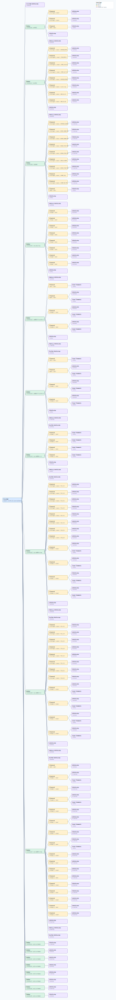

.. This file is auto-generated by doc/gen_emu_xml_trees.py.
   Do not edit manually.

Emulation Context: ad9084-fmca-ebz.xml
======================================

Source XML: ``test/emu/devices/ad9084-fmca-ebz.xml``

Diagram
-------

.. Note:: The diagram intentionally groups large attribute lists to keep
   the structure readable.

Text Preview
------------

.. code-block:: text

   context name=network description=10.44.3.52 Linux buildroot 6.6.0-25331-g6b0855a7e896 #179 Thu Jul 17 16:12:05 CEST 2025 microblaze
   |-- context-attribute name=ip,ip-addr value=10.44.3.52
   |-- context-attribute name=local,kernel value=6.6.0-25331-g6b0855a7e896
   |-- context-attribute name=uri value=ip:10.44.3.52
   |-- device id=iio:device0 name=adf4382
   |   |-- channel id=altvoltage0 type=output
   |   |   |-- attribute name=en filename=out_altvoltage0_en value=1
   |   |   |-- attribute name=en_auto_align filename=out_altvoltage_en_auto_align value=1
   |   |   |-- attribute name=frequency filename=out_altvoltage_frequency value=16200000000
   |   |   |-- attribute name=hardwaregain filename=out_altvoltage0_hardwaregain value=11
   |   |   `-- attribute name=phase filename=out_altvoltage_phase value=250
   |   |-- channel id=altvoltage1 type=output
   |   |   |-- attribute name=en filename=out_altvoltage1_en value=1
   |   |   |-- attribute name=en_auto_align filename=out_altvoltage_en_auto_align value=1
   |   |   |-- attribute name=frequency filename=out_altvoltage_frequency value=16200000000
   |   |   |-- attribute name=hardwaregain filename=out_altvoltage1_hardwaregain value=0
   |   |   `-- attribute name=phase filename=out_altvoltage_phase value=250
   |   |-- channel id=temp0 type=input
   |   |   `-- attribute name=input filename=in_temp0_input value=68000
   |   |-- attribute name=waiting_for_supplier value=0
