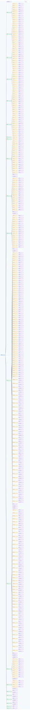

.. This file is auto-generated by doc/gen_emu_xml_trees.py.
   Do not edit manually.

Emulation Context: ad9084.xml
=============================

Source XML: ``test/emu/devices/ad9084.xml``

Diagram
-------

.. Note:: The diagram intentionally groups large attribute lists to keep
   the structure readable.

Text Preview
------------

.. code-block:: text

   context name=network description=10.44.3.71 Linux buildroot 5.10.0-20071-gea808377a2e9-dirty #1156 Wed Jul 5 14:54:31 CEST 2023 microblaze
   |-- context-attribute name=ip,ip-addr value=10.44.3.71
   |-- context-attribute name=local,kernel value=5.10.0-20071-gea808377a2e9-dirty
   |-- context-attribute name=uri value=ip:10.44.3.71
   |-- device id=hwmon0 name=ltc2977
   |   |-- channel id=in1 type=input
   |   |   |-- attribute name=crit filename=in1_crit value=14000
   |   |   |-- attribute name=crit_alarm filename=in1_crit_alarm value=0
   |   |   |-- attribute name=highest filename=in1_highest value=12265
   |   |   |-- attribute name=input filename=in1_input value=12000
   |   |   |-- attribute name=label filename=in1_label value=vin
   |   |   |-- attribute name=lcrit filename=in1_lcrit value=0
   |   |   |-- attribute name=lcrit_alarm filename=in1_lcrit_alarm value=0
   |   |   |-- attribute name=lowest filename=in1_lowest value=12000
   |   |   |-- attribute name=max filename=in1_max value=13203
   |   |   |-- attribute name=max_alarm filename=in1_max_alarm value=0
   |   |   |-- attribute name=min filename=in1_min value=0
   |   |   |-- attribute name=min_alarm filename=in1_min_alarm value=0
   |   |   `-- attribute name=reset_history filename=in1_reset_history value=0
   |   |-- channel id=in2 type=input
