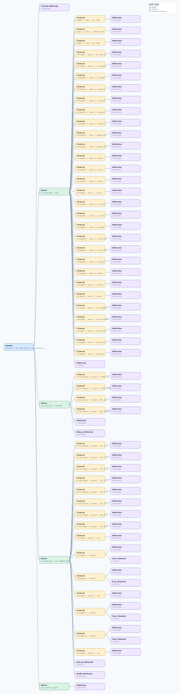

.. This file is auto-generated by doc/gen_emu_xml_trees.py.
   Do not edit manually.

Emulation Context: ad9172.xml
=============================

Source XML: ``test/emu/devices/ad9172.xml``

Diagram
-------

.. Note:: The diagram intentionally groups large attribute lists to keep
   the structure readable.

Text Preview
------------

.. code-block:: text

   context name=network description=192.168.10.81 Linux analog 4.19.0-g17f4223 #1849 SMP Tue Jul 27 13:12:14 IST 2021 aarch64
   |-- context-attribute name=ip,ip-addr value=192.168.10.81
   |-- context-attribute name=local,kernel value=4.19.0-g17f4223
   |-- context-attribute name=uri value=ip:192.168.10.81
   |-- device id=iio:device0 name=ams
   |   |-- channel id=temp0 type=input name=ps_temp
   |   |   |-- attribute name=offset filename=in_temp0_ps_temp_offset value=-36058
   |   |   |-- attribute name=raw filename=in_temp0_ps_temp_raw value=40444
   |   |   `-- attribute name=scale filename=in_temp0_ps_temp_scale value=7.771514892
   |   |-- channel id=temp1 type=input name=remote_temp
   |   |   |-- attribute name=offset filename=in_temp1_remote_temp_offset value=-36058
   |   |   |-- attribute name=raw filename=in_temp1_remote_temp_raw value=40428
   |   |   `-- attribute name=scale filename=in_temp1_remote_temp_scale value=7.771514892
   |   |-- channel id=temp2 type=input name=pl_temp
   |   |   |-- attribute name=offset filename=in_temp2_pl_temp_offset value=-36058
   |   |   |-- attribute name=raw filename=in_temp2_pl_temp_raw value=40494
   |   |   `-- attribute name=scale filename=in_temp2_pl_temp_scale value=7.771514892
   |   |-- channel id=voltage0 type=input name=vcc_pspll0
   |   |   |-- attribute name=raw filename=in_voltage0_vcc_pspll0_raw value=26131
   |   |   `-- attribute name=scale filename=in_voltage0_vcc_pspll0_scale value=0.045776367
