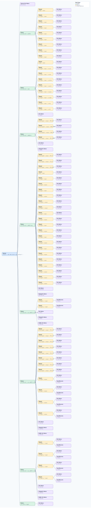

.. This file is auto-generated by doc/gen_emu_xml_trees.py.
   Do not edit manually.

Emulation Context: ad9371.xml
=============================

Source XML: ``test/emu/devices/ad9371.xml``

Diagram
-------

.. Note:: The diagram intentionally groups large attribute lists to keep
   the structure readable.

Text Preview
------------

.. code-block:: text

   context name=network description=192.168.10.241 Linux analog 5.15.0-175820-gf20796462fab #4226 SMP PREEMPT Tue Jul 18 06:45:37 IST 2023 armv7l
   |-- context-attribute name=hdl_system_id value=[adrv9371x] on [zc706] git branch [master] git [86c9847c5fc14c2137aadb36125f04956f20fde0] clean [2023-07-12 00:51:19] UTC
   |-- context-attribute name=hw_carrier value=Xilinx Zynq ZC706
   |-- context-attribute name=hw_mezzanine value=ADRV9371-W/PCBZ
   |-- context-attribute name=hw_model value=ADRV9371-W/PCBZ on Xilinx Zynq ZC706
   |-- context-attribute name=hw_name value=Wide Tuning Range AD9371 Eval Brd
   |-- context-attribute name=hw_serial value=00161
   |-- context-attribute name=hw_vendor value=Analog Devices
   |-- context-attribute name=ip,ip-addr value=192.168.10.241
   |-- context-attribute name=local,kernel value=5.15.0-175820-gf20796462fab
   |-- context-attribute name=uri value=ip:192.168.10.241
   |-- device id=iio:device0 name=ad7291
   |   |-- channel id=temp0 type=input
   |   |   |-- attribute name=mean_raw filename=in_temp0_mean_raw value=193
   |   |   |-- attribute name=raw filename=in_temp0_raw value=192
   |   |   `-- attribute name=scale filename=in_temp0_scale value=250
   |   |-- channel id=voltage0 type=input
   |   |   |-- attribute name=raw filename=in_voltage0_raw value=2789
   |   |   `-- attribute name=scale filename=in_voltage_scale value=0.610351562
   |   |-- channel id=voltage1 type=input
