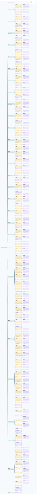

.. This file is auto-generated by doc/gen_emu_xml_trees.py.
   Do not edit manually.

Emulation Context: ad9375.xml
=============================

Source XML: ``test/emu/devices/ad9375.xml``

Diagram
-------

.. Note:: The diagram intentionally groups large attribute lists to keep
   the structure readable.

Text Preview
------------

.. code-block:: text

   context name=network description=192.168.10.231 Linux analog 5.15.0-175834-ga8f4e04aad8f #218 SMP Wed Aug 23 14:14:47 EEST 2023 aarch64
   |-- context-attribute name=hdl_system_id value=[adrv9371x] on [zcu102] git branch [next_stable] git [e9044e9b8c3bf9c75c46175449c3c833a41ea106] clean [2023-08-18 14:06:27] UTC
   |-- context-attribute name=hw_carrier value=ZynqMP ZCU102 Rev1.0
   |-- context-attribute name=hw_mezzanine value=ADRV9375-W/PCBZ
   |-- context-attribute name=hw_model value=ADRV9375-W/PCBZ on ZynqMP ZCU102 Rev1.0
   |-- context-attribute name=hw_name value=Wide Tuning Range AD9375 Eval Brd
   |-- context-attribute name=hw_serial value=00068
   |-- context-attribute name=hw_vendor value=Analog Devices
   |-- context-attribute name=ip,ip-addr value=192.168.10.231
   |-- context-attribute name=local,kernel value=5.15.0-175834-ga8f4e04aad8f
   |-- context-attribute name=unique_id value=1000002353635912002000052710153ead
   |-- context-attribute name=uri value=ip:192.168.10.231
   |-- device id=hwmon0 name=ina226
   |   |-- channel id=curr1 type=input
   |   |   `-- attribute name=input filename=curr1_input value=1234
   |   |-- channel id=in0 type=input
   |   |   |-- attribute name=crit filename=in0_crit value=0
   |   |   |-- attribute name=crit_alarm filename=in0_crit_alarm value=0
   |   |   |-- attribute name=input filename=in0_input value=6
   |   |   |-- attribute name=lcrit filename=in0_lcrit value=0
