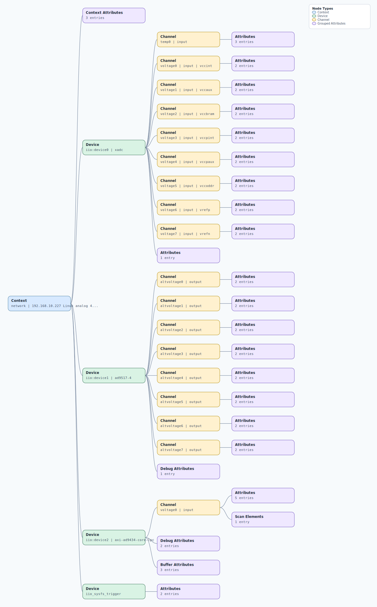

.. This file is auto-generated by doc/gen_emu_xml_trees.py.
   Do not edit manually.

Emulation Context: ad9434.xml
=============================

Source XML: ``test/emu/devices/ad9434.xml``

Diagram
-------

.. Note:: The diagram intentionally groups large attribute lists to keep
   the structure readable.

Text Preview
------------

.. code-block:: text

   context name=network description=192.168.10.227 Linux analog 4.19.0-g17f4223 #1848 SMP PREEMPT Tue Jul 27 12:46:50 IST 2021 armv7l
   |-- context-attribute name=ip,ip-addr value=192.168.10.227
   |-- context-attribute name=local,kernel value=4.19.0-g17f4223
   |-- context-attribute name=uri value=ip:192.168.10.227
   |-- device id=iio:device0 name=xadc
   |   |-- channel id=temp0 type=input
   |   |   |-- attribute name=offset filename=in_temp0_offset value=-2219
   |   |   |-- attribute name=raw filename=in_temp0_raw value=2508
   |   |   `-- attribute name=scale filename=in_temp0_scale value=123.040771484
   |   |-- channel id=voltage0 type=input name=vccint
   |   |   |-- attribute name=raw filename=in_voltage0_vccint_raw value=1355
   |   |   `-- attribute name=scale filename=in_voltage0_vccint_scale value=0.732421875
   |   |-- channel id=voltage1 type=input name=vccaux
   |   |   |-- attribute name=raw filename=in_voltage1_vccaux_raw value=2445
   |   |   `-- attribute name=scale filename=in_voltage1_vccaux_scale value=0.732421875
   |   |-- channel id=voltage2 type=input name=vccbram
   |   |   |-- attribute name=raw filename=in_voltage2_vccbram_raw value=1352
   |   |   `-- attribute name=scale filename=in_voltage2_vccbram_scale value=0.732421875
   |   |-- channel id=voltage3 type=input name=vccpint
   |   |   |-- attribute name=raw filename=in_voltage3_vccpint_raw value=1345
