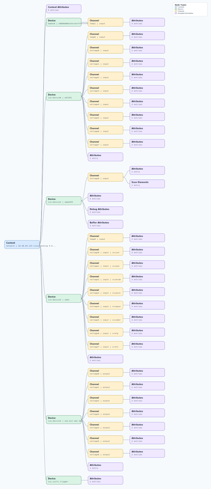

.. This file is auto-generated by doc/gen_emu_xml_trees.py.
   Do not edit manually.

Emulation Context: ada4355.xml
==============================

Source XML: ``test/emu/devices/ada4355.xml``

Diagram
-------

.. Note:: The diagram intentionally groups large attribute lists to keep
   the structure readable.

Text Preview
------------

.. code-block:: text

   context name=network description=10.48.65.215 Linux analog 6.6.0-25269-g34bb38377c9d #145 SMP PREEMPT Mon Jul 14 14:02:32 EEST 2025 armv7l
   |-- context-attribute name=hdl_system_id value=[ada4355_fmc] [BUFMRCE_EN] on [zed] git branch [ada4355_xdc_update] git [5781fd85b80b06cce0cd608f0440a30fd11cabb4] dirty [2025-08-13 05:58:27] UTC
   |-- context-attribute name=hw_carrier value=Xilinx Zynq ZED
   |-- context-attribute name=ip,ip-addr value=10.48.65.215
   |-- context-attribute name=local,kernel value=6.6.0-25269-g34bb38377c9d
   |-- context-attribute name=uri value=ip:10.48.65.215
   |-- device id=hwmon0 name=e000b000ethernetffffffff00
   |   `-- channel id=temp1 type=input
   |       |-- attribute name=crit filename=temp1_crit value=100000
   |       |-- attribute name=input filename=temp1_input value=41000
   |       `-- attribute name=max_alarm filename=temp1_max_alarm value=0
   |-- device id=iio:device0 name=ad7291
   |   |-- channel id=temp0 type=input
   |   |   |-- attribute name=mean_raw filename=in_temp0_mean_raw value=134
   |   |   |-- attribute name=raw filename=in_temp0_raw value=134
   |   |   `-- attribute name=scale filename=in_temp0_scale value=250
   |   |-- channel id=voltage0 type=input
   |   |   |-- attribute name=raw filename=in_voltage0_raw value=2092
   |   |   `-- attribute name=scale filename=in_voltage_scale value=0.610351562
   |   |-- channel id=voltage1 type=input
