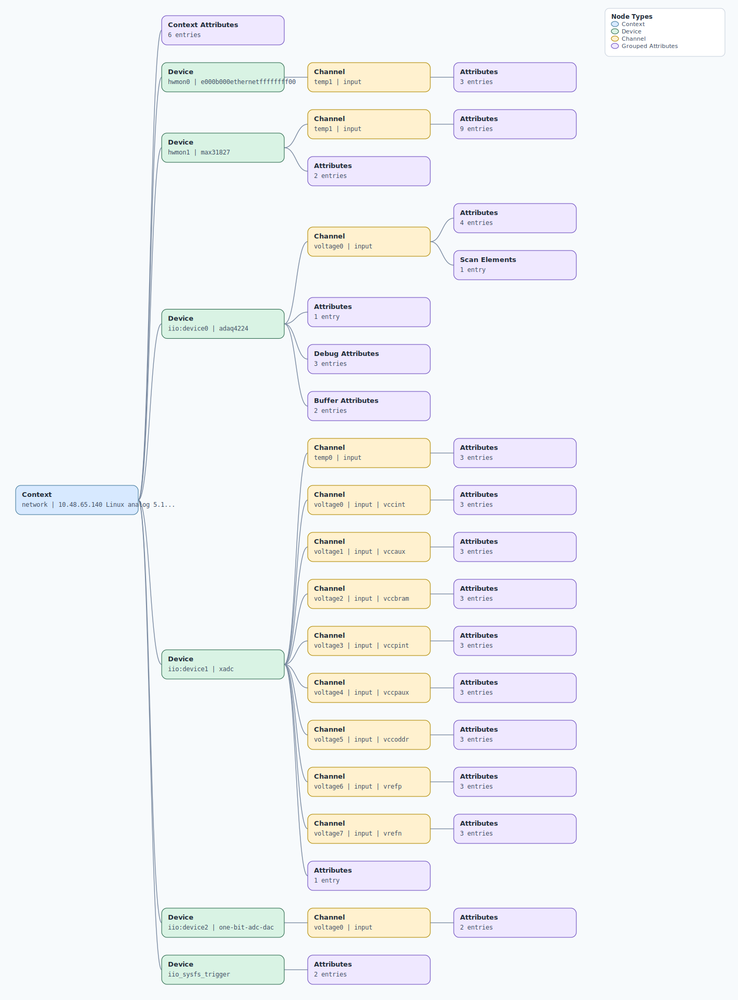

.. This file is auto-generated by doc/gen_emu_xml_trees.py.
   Do not edit manually.

Emulation Context: adaq4224.xml
===============================

Source XML: ``test/emu/devices/adaq4224.xml``

Diagram
-------

.. Note:: The diagram intentionally groups large attribute lists to keep
   the structure readable.

Text Preview
------------

.. code-block:: text

   context name=network description=10.48.65.140 Linux analog 5.15.0-175797-g686d161a4f43 #385 SMP PREEMPT Fri Sep 22 17:08:22 EEST 2023 armv7l
   |-- context-attribute name=hdl_system_id value=[AD463XADAQ42XXN0_CLKMODE0_NUMOFSDI1_CAPTUREZONE2_DDREN0/ad463x_adaq42xx_zed] [sys rom custom string placeholder] on [zed] git branch [dev_adaq4224_final] git [7df56bd2d04bdccc44d9bbfa94c800b828abb80f] dirty [2023-11-01 14:03:21] UTC
   |-- context-attribute name=hw_carrier value=Xilinx Zynq ZED
   |-- context-attribute name=hw_model value=EVAL-ADAQ4224-FMCZ on Xilinx Zynq ZED
   |-- context-attribute name=ip,ip-addr value=10.48.65.140
   |-- context-attribute name=local,kernel value=5.15.0-175797-g686d161a4f43
   |-- context-attribute name=uri value=ip:10.48.65.140
   |-- device id=hwmon0 name=e000b000ethernetffffffff00
   |   `-- channel id=temp1 type=input
   |       |-- attribute name=crit filename=temp1_crit value=100000
   |       |-- attribute name=input filename=temp1_input value=31000
   |       `-- attribute name=max_alarm filename=temp1_max_alarm value=0
   |-- device id=hwmon1 name=max31827
   |   |-- channel id=temp1 type=input
   |   |   |-- attribute name=enable filename=temp1_enable value=1
   |   |   |-- attribute name=input filename=temp1_input value=37437
   |   |   |-- attribute name=max filename=temp1_max value=100000
   |   |   |-- attribute name=max_alarm filename=temp1_max_alarm value=1
   |   |   |-- attribute name=max_hyst filename=temp1_max_hyst value=-312
   |   |   |-- attribute name=min filename=temp1_min value=-40000
