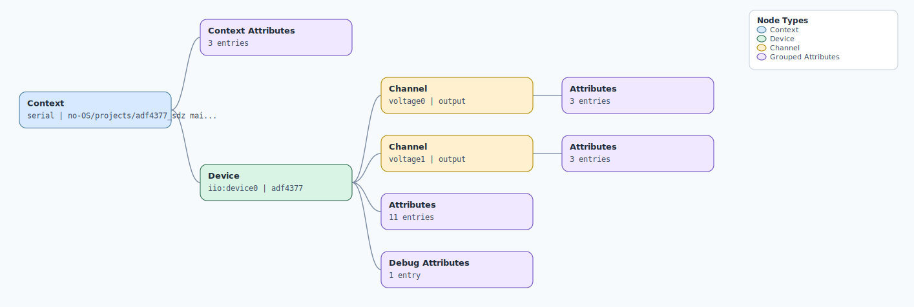

.. This file is auto-generated by doc/gen_emu_xml_trees.py.
   Do not edit manually.

Emulation Context: adf4377.xml
==============================

Source XML: ``test/emu/devices/adf4377.xml``

Diagram
-------

.. Note:: The diagram intentionally groups large attribute lists to keep
   the structure readable.

Text Preview
------------

.. code-block:: text

   context name=serial description=no-OS/projects/adf4377_sdz main-91ccda4fe
   |-- context-attribute name=serial,description value=USB Serial Device (COM5)
   |-- context-attribute name=serial,port value=COM5
   |-- context-attribute name=uri value=serial:COM5,115200,8n1n
   `-- device id=iio:device0 name=adf4377
       |-- channel id=voltage0 type=output
       |   |-- attribute name=enable filename=out_voltage0_enable value=1
       |   |-- attribute name=frequency filename=out_voltage0_frequency value=10000000000
       |   `-- attribute name=output_power filename=out_voltage0_output_power value=3
       |-- channel id=voltage1 type=output
       |   |-- attribute name=enable filename=out_voltage1_enable value=1
       |   |-- attribute name=frequency filename=out_voltage1_frequency value=10000000000
       |   `-- attribute name=output_power filename=out_voltage1_output_power value=3
       |-- attribute name=bleed_current value=167
       |-- attribute name=charge_pump_available value=ERROR
       |-- attribute name=charge_pump_current value=11.100000
       |-- attribute name=reference_clock value=125000000
       |-- attribute name=reference_divider value=1
       |-- attribute name=reference_doubler_enable value=1
       |-- attribute name=rfout_divider value=1029990688
