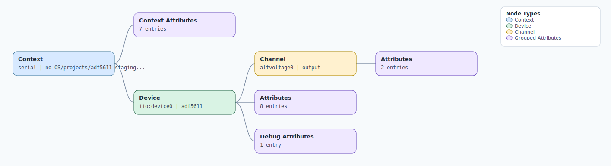

.. This file is auto-generated by doc/gen_emu_xml_trees.py.
   Do not edit manually.

Emulation Context: adf5611.xml
==============================

Source XML: ``test/emu/devices/adf5611.xml``

Diagram
-------

.. Note:: The diagram intentionally groups large attribute lists to keep
   the structure readable.

Text Preview
------------

.. code-block:: text

   context name=serial description=no-OS/projects/adf5611 staging/adf5611-dev-f1be8c225
   |-- context-attribute name=hw_carrier value=EV-ADF5611SD1Z
   |-- context-attribute name=hw_mezzanine value=SDP_K1
   |-- context-attribute name=hw_name value=DEV_ADF5611
   |-- context-attribute name=hw_vendor value=Analog Devices
   |-- context-attribute name=serial,description value=serial:/dev/ttyACM0,230400,8n1n
   |-- context-attribute name=serial,port value=/dev/ttyACM0
   |-- context-attribute name=uri value=DAPLink CMSIS-DAP - 0604000062024e45002950043427001ec001000197969900
   `-- device id=iio:device0 name=adf5611
       |-- channel id=altvoltage0 type=output
       |   |-- attribute name=rfout_frequency filename=out_altvoltage_rfout_frequency value=12000000000
       |   `-- attribute name=rfout_power filename=out_altvoltage_rfout_power value=3
       |-- attribute name=charge_pump_current value=3.200000
       |-- attribute name=charge_pump_current_available value=ERROR
       |-- attribute name=en_rfoutdiv value=1
       |-- attribute name=reference_divider value=2
       |-- attribute name=reference_frequency value=122880000
       |-- attribute name=rfoutdiv_divider value=1
       |-- attribute name=rfoutdiv_divider_available value=1 2 4 8 16 32 64 128
       |-- attribute name=rfoutdiv_power value=0
