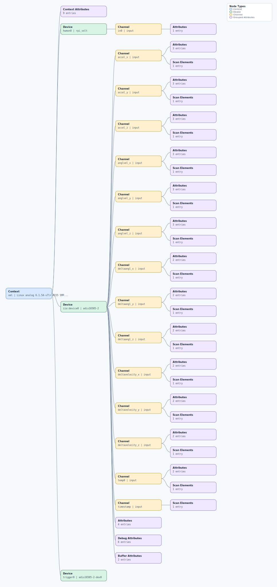

.. This file is auto-generated by doc/gen_emu_xml_trees.py.
   Do not edit manually.

Emulation Context: adis16475.xml
================================

Source XML: ``test/emu/devices/adis16475.xml``

Diagram
-------

.. Note:: The diagram intentionally groups large attribute lists to keep
   the structure readable.

Text Preview
------------

.. code-block:: text

   context name=xml description=Linux analog 6.1.54-v7l+ #155 SMP Mon Jan 22 15:09:37 EET 2024 armv7l
   |-- context-attribute name=dtoverlay value=vc4-kms-v3d,adis16475
   |-- context-attribute name=hw_carrier value=Raspberry Pi 4 Model B Rev 1.2
   |-- context-attribute name=hw_mezzanine value=0x0001
   |-- context-attribute name=hw_model value=0x0001 on Raspberry Pi 4 Model B Rev 1.2
   |-- context-attribute name=hw_name value=PMD-RPI-INTZ
   |-- context-attribute name=hw_serial value=bfc337a9-ebe6-48bb-afe4-c75456ab366c
   |-- context-attribute name=hw_vendor value=Analog Devices, Inc.
   |-- context-attribute name=local,kernel value=6.1.54-v7l+
   |-- context-attribute name=uri value=local:
   |-- device id=hwmon0 name=rpi_volt
   |   `-- channel id=in0 type=input
   |       `-- attribute name=lcrit_alarm filename=in0_lcrit_alarm value=0
   |-- device id=iio:device0 name=adis16505-2
   |   |-- channel id=accel_x type=input
   |   |   |-- scan-element index=3 format=be:S32/32>>0 scale=0.000000
   |   |   |-- attribute name=calibbias filename=in_accel_x_calibbias value=0
   |   |   |-- attribute name=raw filename=in_accel_x_raw value=-1503047
   |   |   `-- attribute name=scale filename=in_accel_scale value=0.000000037
   |   |-- channel id=accel_y type=input
