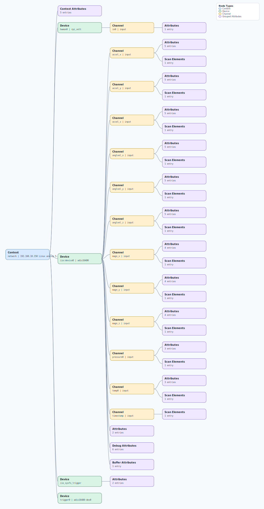

.. This file is auto-generated by doc/gen_emu_xml_trees.py.
   Do not edit manually.

Emulation Context: adis16480.xml
================================

Source XML: ``test/emu/devices/adis16480.xml``

Diagram
-------

.. Note:: The diagram intentionally groups large attribute lists to keep
   the structure readable.

Text Preview
------------

.. code-block:: text

   context name=network description=192.168.10.150 Linux analog 5.15.92-v7l+ #1 SMP Mon Feb 26 08:31:10 UTC 2024 armv7l
   |-- context-attribute name=dtoverlay value=vc4-kms-v3d,adis16480
   |-- context-attribute name=hw_carrier value=Raspberry Pi 4 Model B Rev 1.1
   |-- context-attribute name=ip,ip-addr value=192.168.10.150
   |-- context-attribute name=local,kernel value=5.15.92-v7l+
   |-- context-attribute name=uri value=ip:192.168.10.150
   |-- device id=hwmon0 name=rpi_volt
   |   `-- channel id=in0 type=input
   |       `-- attribute name=lcrit_alarm filename=in0_lcrit_alarm value=0
   |-- device id=iio:device0 name=adis16480
   |   |-- channel id=accel_x type=input
   |   |   |-- scan-element index=3 format=be:S32/32>>0 scale=0.000000
   |   |   |-- attribute name=calibbias filename=in_accel_x_calibbias value=0
   |   |   |-- attribute name=calibscale filename=in_accel_x_calibscale value=0
   |   |   |-- attribute name=filter_low_pass_3db_frequency filename=in_accel_x_filter_low_pass_3db_frequency value=0
   |   |   |-- attribute name=raw filename=in_accel_x_raw value=75935
   |   |   `-- attribute name=scale filename=in_accel_scale value=0.000000119
   |   |-- channel id=accel_y type=input
   |   |   |-- scan-element index=4 format=be:S32/32>>0 scale=0.000000
   |   |   |-- attribute name=calibbias filename=in_accel_y_calibbias value=0
