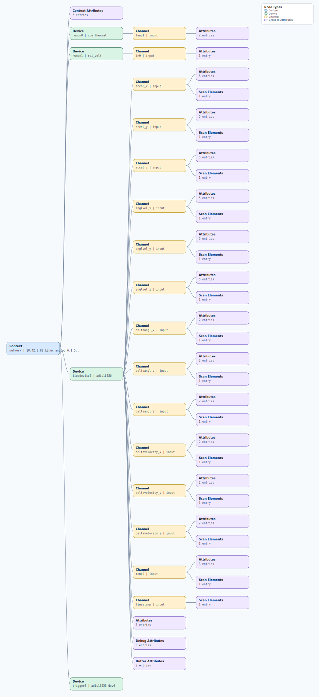

.. This file is auto-generated by doc/gen_emu_xml_trees.py.
   Do not edit manually.

Emulation Context: adis16550.xml
================================

Source XML: ``test/emu/devices/adis16550.xml``

Diagram
-------

.. Note:: The diagram intentionally groups large attribute lists to keep
   the structure readable.

Text Preview
------------

.. code-block:: text

   context name=network description=10.42.0.83 Linux analog 6.1.54-v7l+ #8 SMP Mon Sep 30 11:56:09 BST 2024 armv7l
   |-- context-attribute name=dtoverlay value=vc4-kms-v3d,adis16550
   |-- context-attribute name=hw_carrier value=Raspberry Pi 4 Model B Rev 1.2
   |-- context-attribute name=ip,ip-addr value=10.42.0.83
   |-- context-attribute name=local,kernel value=6.1.54-v7l+
   |-- context-attribute name=uri value=ip:10.42.0.83
   |-- device id=hwmon0 name=cpu_thermal
   |   `-- channel id=temp1 type=input
   |       |-- attribute name=crit filename=temp1_crit value=110000
   |       `-- attribute name=input filename=temp1_input value=65731
   |-- device id=hwmon1 name=rpi_volt
   |   `-- channel id=in0 type=input
   |       `-- attribute name=lcrit_alarm filename=in0_lcrit_alarm value=0
   |-- device id=iio:device0 name=adis16550
   |   |-- channel id=accel_x type=input
   |   |   |-- scan-element index=3 format=be:S32/32>>0 scale=0.000000
   |   |   |-- attribute name=calibbias filename=in_accel_x_calibbias value=0
   |   |   |-- attribute name=calibscale filename=in_accel_x_calibscale value=0
   |   |   |-- attribute name=filter_low_pass_3db_frequency filename=in_accel_filter_low_pass_3db_frequency value=0
   |   |   |-- attribute name=raw filename=in_accel_x_raw value=-210881
