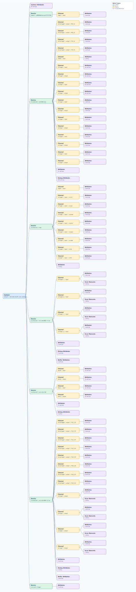

.. This file is auto-generated by doc/gen_emu_xml_trees.py.
   Do not edit manually.

Emulation Context: adrv9002.xml
===============================

Source XML: ``test/emu/devices/adrv9002.xml``

Diagram
-------

.. Note:: The diagram intentionally groups large attribute lists to keep
   the structure readable.

Text Preview
------------

.. code-block:: text

   context name=network description=192.168.10.107 Linux analog 5.15.0-175828-g0a3ef1dba842 #4436 SMP PREEMPT Tue Aug 1 06:45:40 IST 2023 armv7l
   |-- context-attribute name=hdl_system_id value=[adrv9001] on [zed] git branch [master] git [ea29a37eae8a1daeaadb79281b3085709aaedb1c] clean [2023-07-26 06:22:31] UTC
   |-- context-attribute name=hw_carrier value=Xilinx Zynq ZED
   |-- context-attribute name=hw_mezzanine value=ADRV9002NP/W1/PCBZ
   |-- context-attribute name=hw_model value=ADRV9002NP/W1/PCBZ on Xilinx Zynq ZED
   |-- context-attribute name=hw_name value=ADRV9001 Cust.EVB
   |-- context-attribute name=hw_serial value=07500127
   |-- context-attribute name=hw_vendor value=Analog Devices
   |-- context-attribute name=ip,ip-addr value=192.168.10.107
   |-- context-attribute name=local,kernel value=5.15.0-175828-g0a3ef1dba842
   |-- context-attribute name=uri value=ip:192.168.10.107
   |-- device id=hwmon0 name=e000b000ethernetffffffff00
   |   `-- channel id=temp1 type=input
   |       |-- attribute name=crit filename=temp1_crit value=100000
   |       |-- attribute name=input filename=temp1_input value=44000
   |       `-- attribute name=max_alarm filename=temp1_max_alarm value=0
   |-- device id=iio:device0 name=adrv9002-phy
   |   |-- channel id=altvoltage0 type=output name=RX1_LO
   |   |   |-- attribute name=frequency filename=out_altvoltage0_RX1_LO_frequency value=2400000000
   |   |   `-- attribute name=label filename=out_altvoltage0_RX1_LO_label value=RX1_LO
