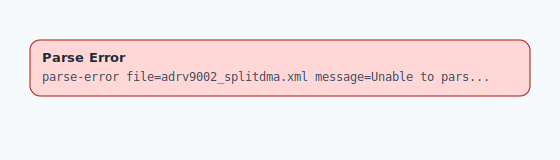

.. This file is auto-generated by doc/gen_emu_xml_trees.py.
   Do not edit manually.

Emulation Context: adrv9002_splitdma.xml
========================================

Source XML: ``test/emu/devices/adrv9002_splitdma.xml``

Diagram
-------

.. Note:: The diagram intentionally groups large attribute lists to keep
   the structure readable.

Text Preview
------------

.. code-block:: text

   parse-error file=adrv9002_splitdma.xml message=Unable to parse XML context adrv9002_splitdma.xml: syntax error: line 1, column 0
