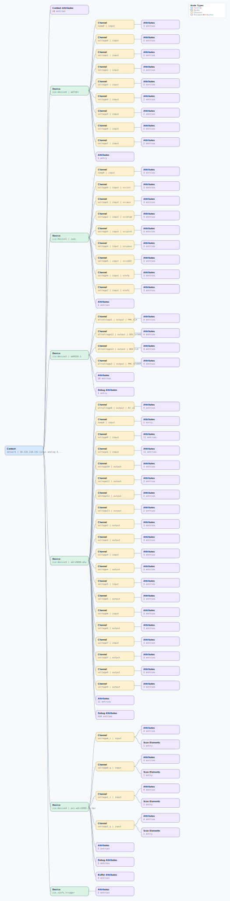

.. This file is auto-generated by doc/gen_emu_xml_trees.py.
   Do not edit manually.

Emulation Context: adrv9008-1.xml
=================================

Source XML: ``test/emu/devices/adrv9008-1.xml``

Diagram
-------

.. Note:: The diagram intentionally groups large attribute lists to keep
   the structure readable.

Text Preview
------------

.. code-block:: text

   context name=network description=10.116.110.141 Linux analog 6.1.70-284094-g54eb23f4b5c6 #209 SMP PREEMPT Fri Nov  8 06:39:15 EET 2024 armv7l
   |-- context-attribute name=hdl_system_id value=[adrv9009] [RX:M=4 L=2 S=1 TX:M=4 L=4 S=1 RX_OS:M=2 L=2 S=1 DAC_FIFO_ADDR_WIDTH=10] on [zc706] git branch [hdl_2023_r2] git [2156ac7e874a1dc321d9f64a325009fafe563419] clean [2024-11-01 15:05:22] UTC
   |-- context-attribute name=hw_carrier value=Xilinx Zynq ZC706
   |-- context-attribute name=hw_mezzanine value=ADRV9009-W/PCBZ
   |-- context-attribute name=hw_model value=ADRV9009-W/PCBZ on Xilinx Zynq ZC706
   |-- context-attribute name=hw_name value=9009RC0,9528
   |-- context-attribute name=hw_serial value=00177
   |-- context-attribute name=hw_vendor value=Analog Devices
   |-- context-attribute name=ip,ip-addr value=10.116.110.141
   |-- context-attribute name=local,kernel value=6.1.70-284094-g54eb23f4b5c6
   |-- context-attribute name=uri value=ip:10.116.110.141
   |-- device id=iio:device0 name=ad7291
   |   |-- channel id=temp0 type=input
   |   |   |-- attribute name=mean_raw filename=in_temp0_mean_raw value=166
   |   |   |-- attribute name=raw filename=in_temp0_raw value=164
   |   |   `-- attribute name=scale filename=in_temp0_scale value=250
   |   |-- channel id=voltage0 type=input
   |   |   |-- attribute name=raw filename=in_voltage0_raw value=2809
   |   |   `-- attribute name=scale filename=in_voltage_scale value=0.610351562
   |   |-- channel id=voltage1 type=input
