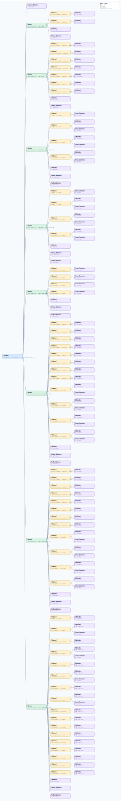

.. This file is auto-generated by doc/gen_emu_xml_trees.py.
   Do not edit manually.

Emulation Context: adsy1100.xml
===============================

Source XML: ``test/emu/devices/adsy1100.xml``

Diagram
-------

.. Note:: The diagram intentionally groups large attribute lists to keep
   the structure readable.

Text Preview
------------

.. code-block:: text

   context name=network description=192.168.2.1 Linux buildroot 6.1.0-ge7a40bdae4e5 #1 Mon Jun 10 08:46:07 UTC 2024 microblaze
   |-- context-attribute name=ip,ip-addr value=192.168.2.1
   |-- context-attribute name=local,kernel value=6.1.0-ge7a40bdae4e5
   |-- context-attribute name=uri value=ip:192.168.2.1
   |-- device id=iio:device0 name=adf4382
   |   |-- channel id=altvoltage0 type=output
   |   |   |-- attribute name=en filename=out_altvoltage0_en value=1
   |   |   |-- attribute name=frequency filename=out_altvoltage_frequency value=12800000000
   |   |   `-- attribute name=output_power filename=out_altvoltage0_output_power value=11
   |   |-- channel id=altvoltage1 type=output
   |   |   |-- attribute name=en filename=out_altvoltage1_en value=0
   |   |   |-- attribute name=frequency filename=out_altvoltage_frequency value=12800000000
   |   |   `-- attribute name=output_power filename=out_altvoltage1_output_power value=0
   |   |-- attribute name=phase value=0
   |   |-- attribute name=waiting_for_supplier value=0
   |   `-- debug-attribute name=direct_reg_access value=0x18
   |-- device id=iio:device1 name=hmc7044
   |   |-- channel id=altvoltage1 type=output name=DEV_SYSREF
   |   |   |-- attribute name=frequency filename=out_altvoltage1_DEV_SYSREF_frequency value=6250000
   |   |   |-- attribute name=label filename=out_altvoltage1_DEV_SYSREF_label value=DEV_SYSREF
