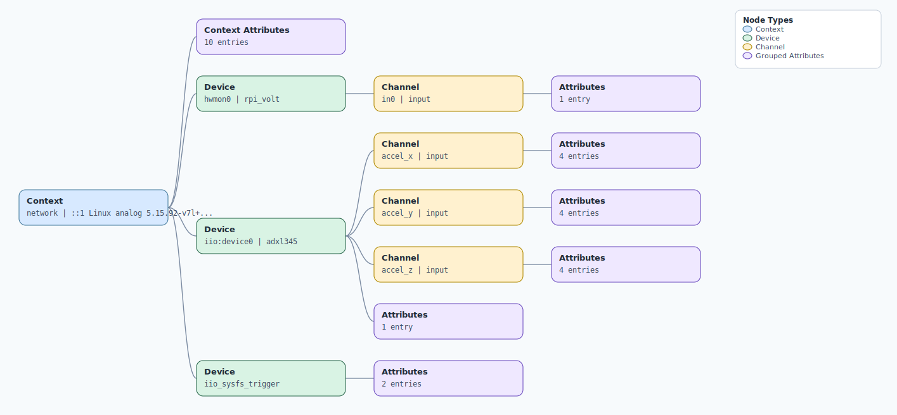

.. This file is auto-generated by doc/gen_emu_xml_trees.py.
   Do not edit manually.

Emulation Context: adxl345.xml
==============================

Source XML: ``test/emu/devices/adxl345.xml``

Diagram
-------

.. Note:: The diagram intentionally groups large attribute lists to keep
   the structure readable.

Text Preview
------------

.. code-block:: text

   context name=network description=::1 Linux analog 5.15.92-v7l+ #1 SMP Wed Dec 6 08:52:11 UTC 2023 armv7l
   |-- context-attribute name=dtoverlay value=vc4-kms-v3d,rpi-adxl345,gpio-shutdown
   |-- context-attribute name=hw_carrier value=Raspberry Pi 4 Model B Rev 1.4
   |-- context-attribute name=hw_mezzanine value=0x0001
   |-- context-attribute name=hw_model value=0x0001 on Raspberry Pi 4 Model B Rev 1.4
   |-- context-attribute name=hw_name value=Raspberry Pi to Pmod/QuikEval/PSM Adapter
   |-- context-attribute name=hw_serial value=23a33bbc-84cb-40fc-977e-93e1f8803552
   |-- context-attribute name=hw_vendor value=Analog Devices, Inc.
   |-- context-attribute name=ip,ip-addr value=::1
   |-- context-attribute name=local,kernel value=5.15.92-v7l+
   |-- context-attribute name=uri value=ip:localhost
   |-- device id=hwmon0 name=rpi_volt
   |   `-- channel id=in0 type=input
   |       `-- attribute name=lcrit_alarm filename=in0_lcrit_alarm value=0
   |-- device id=iio:device0 name=adxl345
   |   |-- channel id=accel_x type=input
   |   |   |-- attribute name=calibbias filename=in_accel_x_calibbias value=200
   |   |   |-- attribute name=raw filename=in_accel_x_raw value=192
   |   |   |-- attribute name=sampling_frequency filename=in_accel_sampling_frequency value=100.000000000
   |   |   `-- attribute name=scale filename=in_accel_scale value=0.038300
