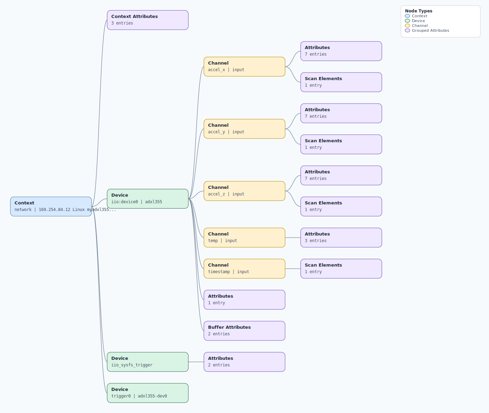

.. This file is auto-generated by doc/gen_emu_xml_trees.py.
   Do not edit manually.

Emulation Context: adxl355.xml
==============================

Source XML: ``test/emu/devices/adxl355.xml``

Diagram
-------

.. Note:: The diagram intentionally groups large attribute lists to keep
   the structure readable.

Text Preview
------------

.. code-block:: text

   context name=network description=169.254.84.12 Linux myadxl355 5.10.63-v7+ #1 SMP Wed Nov 17 10:05:18 PST 2021 armv7l
   |-- context-attribute name=ip,ip-addr value=169.254.84.12
   |-- context-attribute name=local,kernel value=5.10.63-v7+
   |-- context-attribute name=uri value=ip:myadxl355.local
   |-- device id=iio:device0 name=adxl355
   |   |-- channel id=accel_x type=input
   |   |   |-- scan-element index=0 format=be:s20/32>>4 scale=0.000038
   |   |   |-- attribute name=calibbias filename=in_accel_x_calibbias value=0
   |   |   |-- attribute name=filter_high_pass_3db_frequency filename=in_accel_filter_high_pass_3db_frequency value=0.000000
   |   |   |-- attribute name=filter_high_pass_3db_frequency_available filename=in_accel_filter_high_pass_3db_frequency_available value=0.000000 9.880000 2.483360 0.621800 0.154480 0.038160 0.009520
   |   |   |-- attribute name=raw filename=in_accel_x_raw value=-4641
   |   |   |-- attribute name=sampling_frequency filename=in_accel_sampling_frequency value=4000.000000
   |   |   |-- attribute name=sampling_frequency_available filename=in_accel_sampling_frequency_available value=ERROR
   |   |   `-- attribute name=scale filename=in_accel_scale value=0.000038245
   |   |-- channel id=accel_y type=input
   |   |   |-- scan-element index=1 format=be:s20/32>>4 scale=0.000038
   |   |   |-- attribute name=calibbias filename=in_accel_y_calibbias value=0
   |   |   |-- attribute name=filter_high_pass_3db_frequency filename=in_accel_filter_high_pass_3db_frequency value=0.000000
   |   |   |-- attribute name=filter_high_pass_3db_frequency_available filename=in_accel_filter_high_pass_3db_frequency_available value=0.000000 9.880000 2.483360 0.621800 0.154480 0.038160 0.009520
   |   |   |-- attribute name=raw filename=in_accel_y_raw value=-2198
