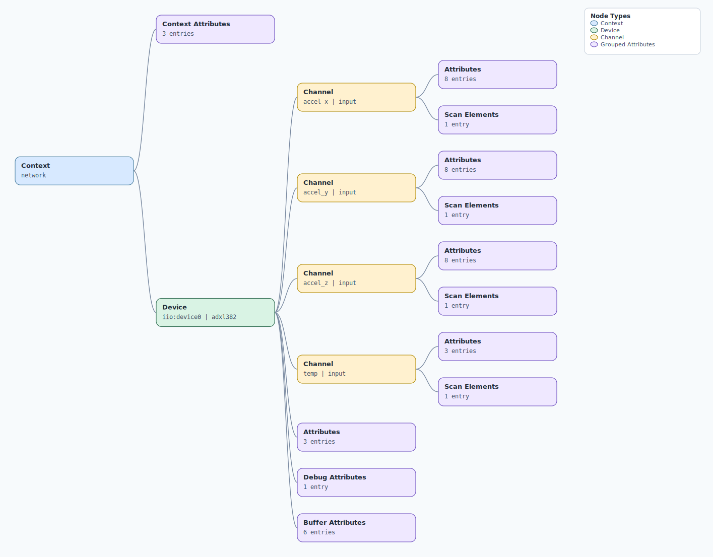

.. This file is auto-generated by doc/gen_emu_xml_trees.py.
   Do not edit manually.

Emulation Context: adxl382.xml
==============================

Source XML: ``test/emu/devices/adxl382.xml``

Diagram
-------

.. Note:: The diagram intentionally groups large attribute lists to keep
   the structure readable.

Text Preview
------------

.. code-block:: text

   context name=network
   |-- context-attribute name=dtoverlay value=vc4-kms-v3d,rpi-adxl380
   |-- context-attribute name=hw_carrier value=Raspberry Pi 4 Model B Rev 1.2
   |-- context-attribute name=local,kernel value=6.1.54-v7l+
   `-- device id=iio:device0 name=adxl382
       |-- channel id=accel_x type=input
       |   |-- scan-element index=0 format=be:S16/16>>0 scale=0.004903
       |   |-- attribute name=calibbias filename=in_accel_x_calibbias value=0
       |   |-- attribute name=filter_high_pass_3db_frequency filename=in_accel_filter_high_pass_3db_frequency value=0.000000
       |   |-- attribute name=filter_high_pass_3db_frequency_available filename=in_accel_filter_high_pass_3db_frequency_available value=0.000000 39.520000 9.933440 2.487200 0.617920 0.152640 0.038080
       |   |-- attribute name=filter_low_pass_3db_frequency filename=in_accel_filter_low_pass_3db_frequency value=16000
       |   |-- attribute name=filter_low_pass_3db_frequency_available filename=in_accel_filter_low_pass_3db_frequency_available value=16000 4000 2000 1000
       |   |-- attribute name=raw filename=in_accel_x_raw value=-1538
       |   |-- attribute name=scale filename=in_accel_scale value=0.004903325
       |   `-- attribute name=scale_available filename=in_accel_scale_available value=0.004903325 0.009806650 0.019613300
       |-- channel id=accel_y type=input
       |   |-- scan-element index=1 format=be:S16/16>>0 scale=0.004903
       |   |-- attribute name=calibbias filename=in_accel_y_calibbias value=0
       |   |-- attribute name=filter_high_pass_3db_frequency filename=in_accel_filter_high_pass_3db_frequency value=0.000000
       |   |-- attribute name=filter_high_pass_3db_frequency_available filename=in_accel_filter_high_pass_3db_frequency_available value=0.000000 39.520000 9.933440 2.487200 0.617920 0.152640 0.038080
