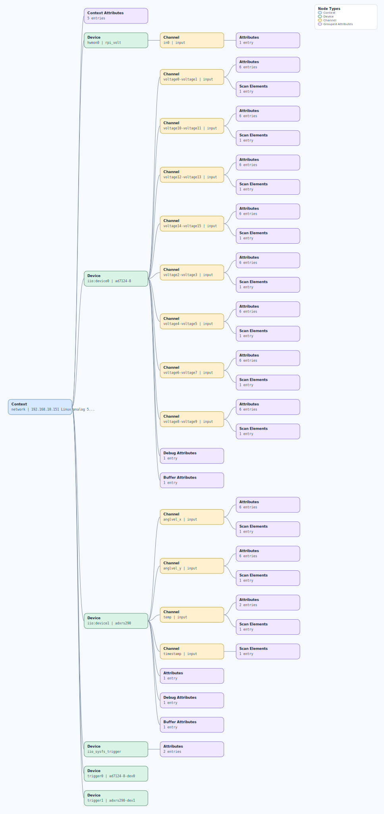

.. This file is auto-generated by doc/gen_emu_xml_trees.py.
   Do not edit manually.

Emulation Context: adxrs290.xml
===============================

Source XML: ``test/emu/devices/adxrs290.xml``

Diagram
-------

.. Note:: The diagram intentionally groups large attribute lists to keep
   the structure readable.

Text Preview
------------

.. code-block:: text

   context name=network description=192.168.10.151 Linux analog 5.15.92-v7l+ #1 SMP Wed Dec 6 08:52:11 UTC 2023 armv7l
   |-- context-attribute name=dtoverlay value=rpi-adxrs290,rpi-ad7124-8-all-diff
   |-- context-attribute name=hw_carrier value=Raspberry Pi 4 Model B Rev 1.1
   |-- context-attribute name=ip,ip-addr value=192.168.10.151
   |-- context-attribute name=local,kernel value=5.15.92-v7l+
   |-- context-attribute name=uri value=ip:192.168.10.151
   |-- device id=hwmon0 name=rpi_volt
   |   `-- channel id=in0 type=input
   |       `-- attribute name=lcrit_alarm filename=in0_lcrit_alarm value=0
   |-- device id=iio:device0 name=ad7124-8
   |   |-- channel id=voltage0-voltage1 type=input
   |   |   |-- scan-element index=0 format=be:u24/32>>0 scale=0.000149
   |   |   |-- attribute name=filter_low_pass_3db_frequency filename=in_voltage0-voltage1_filter_low_pass_3db_frequency value=3
   |   |   |-- attribute name=offset filename=in_voltage0-voltage1_offset value=0
   |   |   |-- attribute name=raw filename=in_voltage0-voltage1_raw value=0
   |   |   |-- attribute name=sampling_frequency filename=in_voltage0-voltage1_sampling_frequency value=10
   |   |   |-- attribute name=scale filename=in_voltage0-voltage1_scale value=0.000149011
   |   |   `-- attribute name=scale_available filename=in_voltage_scale_available value=ERROR
   |   |-- channel id=voltage10-voltage11 type=input
   |   |   |-- scan-element index=5 format=be:u24/32>>0 scale=0.000149
