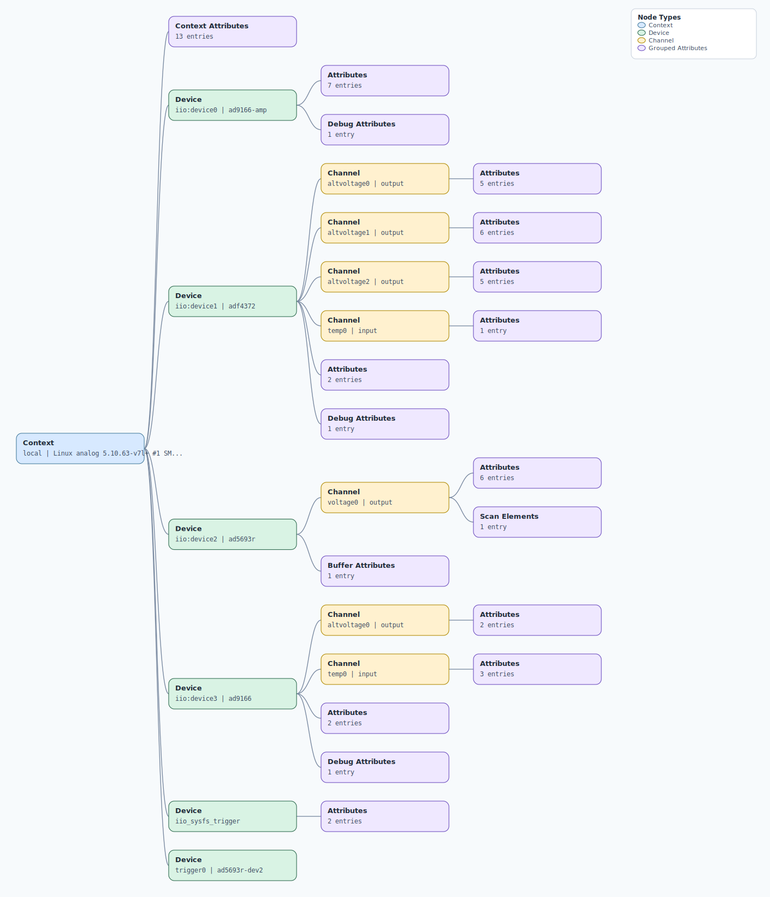

.. This file is auto-generated by doc/gen_emu_xml_trees.py.
   Do not edit manually.

Emulation Context: cn0511.xml
=============================

Source XML: ``test/emu/devices/cn0511.xml``

Diagram
-------

.. Note:: The diagram intentionally groups large attribute lists to keep
   the structure readable.

Text Preview
------------

.. code-block:: text

   context name=local description=Linux analog 5.10.63-v7l+ #1 SMP Fri May 27 12:56:48 UTC 2022 armv7l
   |-- context-attribute name=cn0511_freq value=[100000000, 430000000, 510000000, 850000000, 1240000000, 2250000000, 2790000000, 3040000000, 3140000000, 3220000000, 3360000000, 3460000000, 3560000000, 3630000000, 3720000000, 3810000000, 3850000000, 3950000000, 4000000000, 4070000000, 4120000000, 4180000000, 4260000000, 4360000000, 4440000000, 4730000000, 4860000000, 5010000000, 5110000000, 5670000000, 5730000000, 5860000000]
   |-- context-attribute name=cn0511_gain value=[1.2565445026178007e-07, 3.3544921875e-07, -1.0769329565887484e-07, 1.4522821576763486e-08, 5.306764986122042e-08, 1.0081510081510082e-07, 2.5736040609137073e-07, -3.1037234042553216e-07, 5.852272727272726e-07, 2.305418719211822e-07, -2.2881355932203387e-07, 3.6219512195121936e-07, 1.3952119309262202e-06, -9.388185654008449e-07, 5.782520325203256e-07, -2.974137931034482e-07, 4.2547169811320736e-07, -5.426751592356699e-07, 1.4285714285714287e-07, -1.454545454545454e-07, 9.879807692307702e-07, -1.220930232558139e-07, 5.582608695652176e-07, -4.986979166666671e-07, 2.2954699121027734e-07, -1.391025641025642e-07, 4.4178082191780847e-07, -1.272727272727272e-07, 2.0280612244898007e-07, 7.956521739130434e-07, -4.520917678812415e-08, 8.961038961038966e-07]
   |-- context-attribute name=cn0511_offset value=[273, 306, 334, 301, 304, 358, 420, 487, 456, 504, 529, 506, 547, 655, 570, 619, 611, 658, 627, 640, 627, 668, 660, 695, 658, 727, 701, 776, 762, 887, 930, 912]
   |-- context-attribute name=cn0511_temp value=37401
   |-- context-attribute name=dtoverlay value=vc4-kms-v3d
   |-- context-attribute name=hw_carrier value=Raspberry Pi 4 Model B Rev 1.4
   |-- context-attribute name=hw_mezzanine value=0x0511
   |-- context-attribute name=hw_model value=0x0511 on Raspberry Pi 4 Model B Rev 1.4
   |-- context-attribute name=hw_name value=EVAL-CN0511-RPIZ
   |-- context-attribute name=hw_serial value=559b2a37-a1cc-43a2-8aca-86ddc853fd94
   |-- context-attribute name=hw_vendor value=Analog Devices, Inc.
   |-- context-attribute name=local,kernel value=5.10.63-v7l+
   |-- context-attribute name=uri value=local:
   |-- device id=iio:device0 name=ad9166-amp
   |   |-- attribute name=amp_adc_pwr_down
   |   |-- attribute name=amp_cm
   |   |-- attribute name=amp_vout_trim
   |   |-- attribute name=en
   |   |-- attribute name=pwr_down_dac_current
