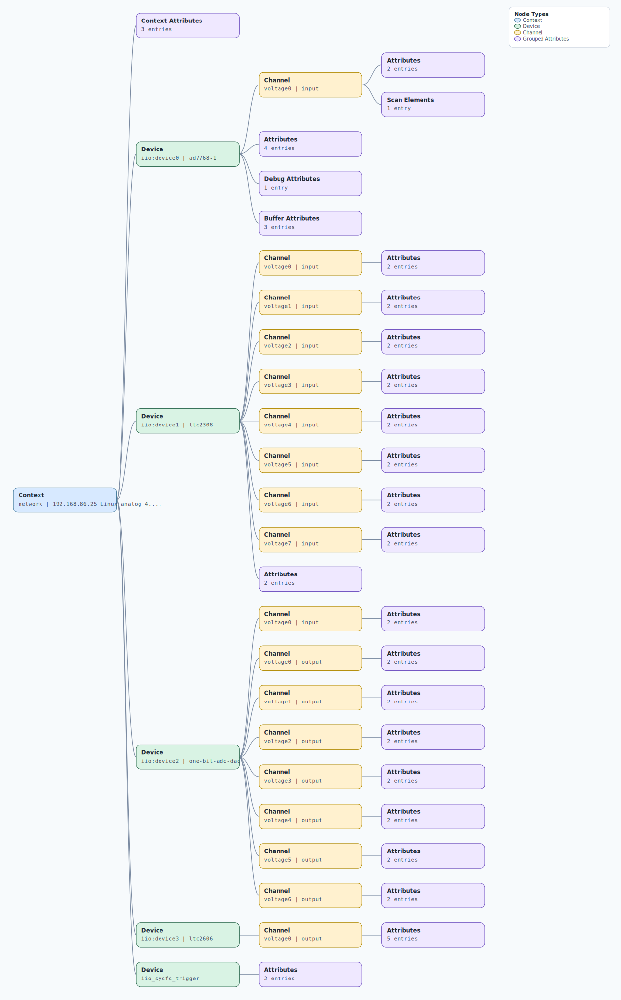

.. This file is auto-generated by doc/gen_emu_xml_trees.py.
   Do not edit manually.

Emulation Context: cn0540.xml
=============================

Source XML: ``test/emu/devices/cn0540.xml``

Diagram
-------

.. Note:: The diagram intentionally groups large attribute lists to keep
   the structure readable.

Text Preview
------------

.. code-block:: text

   context name=network description=192.168.86.25 Linux analog 4.19.0-ga6ef26d #1128 SMP Fri Feb 19 18:19:42 GMT 2021 armv7l
   |-- context-attribute name=ip,ip-addr value=192.168.86.25
   |-- context-attribute name=local,kernel value=4.19.0-ga6ef26d
   |-- context-attribute name=uri value=ip:192.168.86.25
   |-- device id=iio:device0 name=ad7768-1
   |   |-- channel id=voltage0 type=input
   |   |   |-- scan-element index=0 format=le:s24/32>>8 scale=0.000488
   |   |   |-- attribute name=raw filename=in_voltage0_raw value=-4131448
   |   |   `-- attribute name=scale filename=in_voltage_scale value=0.000488281
   |   |-- attribute name=common_mode_voltage value=(AVDD1-AVSS)/2
   |   |-- attribute name=common_mode_voltage_available value=(AVDD1-AVSS)/2 2V5 2V05 1V9 1V65 1V1 0V9 OFF
   |   |-- attribute name=sampling_frequency value=256000
   |   |-- attribute name=sampling_frequency_available value=256000 128000 64000 32000 16000 8000 4000 2000 1000
   |   |-- debug-attribute name=direct_reg_access value=0x0
   |   |-- buffer-attribute name=data_available value=0
   |   |-- buffer-attribute name=length_align_bytes value=16
   |   `-- buffer-attribute name=watermark value=2048
   |-- device id=iio:device1 name=ltc2308
   |   |-- channel id=voltage0 type=input
   |   |   |-- attribute name=raw filename=in_voltage0_raw value=2330
