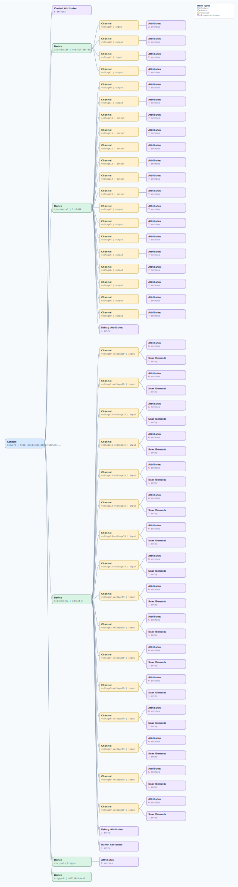

.. This file is auto-generated by doc/gen_emu_xml_trees.py.
   Do not edit manually.

Emulation Context: cn0556.xml
=============================

Source XML: ``test/emu/devices/cn0556.xml``

Diagram
-------

.. Note:: The diagram intentionally groups large attribute lists to keep
   the structure readable.

Text Preview
------------

.. code-block:: text

   context name=network description=fe80::cded:de6a:bb6d:405d%enxa0cec85d2476 Linux analog 5.10.63-v7l+ #2 SMP Thu Jun 15 19:08:26 +08 2023 armv7l
   |-- context-attribute name=dtoverlay value=vc4-kms-v3d,rpi-cn0556_single
   |-- context-attribute name=hw_carrier value=Raspberry Pi 4 Model B Rev 1.5
   |-- context-attribute name=hw_model value=0x0554 on Raspberry Pi 4 Model B Rev 1.4
   |-- context-attribute name=ip,ip-addr value=fe80::cded:de6a:bb6d:405d%enxa0cec85d2476
   |-- context-attribute name=local,kernel value=5.10.63-v7l+
   |-- context-attribute name=uri value=ip:analog.local
   |-- device id=iio:device0 name=one-bit-adc-dac
   |   |-- channel id=voltage0 type=input
   |   |   |-- attribute name=label filename=in_voltage0_label value=REPORT
   |   |   `-- attribute name=raw filename=in_voltage0_raw value=1
   |   |-- channel id=voltage0 type=output
   |   |   |-- attribute name=label filename=out_voltage0_label value=EN
   |   |   `-- attribute name=raw filename=out_voltage0_raw value=1
   |   |-- channel id=voltage1 type=input
   |   |   |-- attribute name=label filename=in_voltage1_label value=FAULT
   |   |   `-- attribute name=raw filename=in_voltage1_raw value=0
   |   `-- channel id=voltage1 type=output
   |       |-- attribute name=label filename=out_voltage1_label value=DRXN
   |       `-- attribute name=raw filename=out_voltage1_raw value=0
