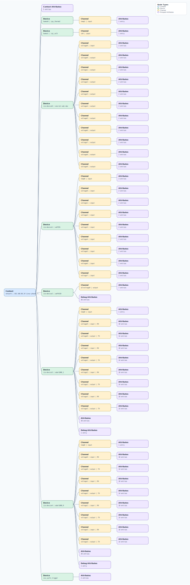

.. This file is auto-generated by doc/gen_emu_xml_trees.py.
   Do not edit manually.

Emulation Context: cn0566.xml
=============================

Source XML: ``test/emu/devices/cn0566.xml``

Diagram
-------

.. Note:: The diagram intentionally groups large attribute lists to keep
   the structure readable.

Text Preview
------------

.. code-block:: text

   context name=network description=192.168.86.24 Linux phaser 5.10.63-v7l+ #1 SMP Fri Mar 10 16:35:58 UTC 2023 armv7l
   |-- context-attribute name=dtoverlay value=rpi-cn0566,gpio-shutdown
   |-- context-attribute name=hw_carrier value=Raspberry Pi 4 Model B Rev 1.5
   |-- context-attribute name=ip,ip-addr value=192.168.86.24
   |-- context-attribute name=local,kernel value=5.10.63-v7l+
   |-- context-attribute name=uri value=ip:phaser.local
   |-- device id=hwmon0 name=cpu_thermal
   |   `-- channel id=temp1 type=input
   |       `-- attribute name=input filename=temp1_input value=43816
   |-- device id=hwmon1 name=rpi_volt
   |   `-- channel id=in0 type=input
   |       `-- attribute name=lcrit_alarm filename=in0_lcrit_alarm value=0
   |-- device id=iio:device0 name=one-bit-adc-dac
   |   |-- channel id=voltage0 type=input
   |   |   |-- attribute name=label filename=in_voltage0_label value=MUXOUT
   |   |   `-- attribute name=raw filename=in_voltage0_raw value=0
   |   |-- channel id=voltage0 type=output
   |   |   |-- attribute name=label filename=out_voltage0_label value=DIV_S0
   |   |   `-- attribute name=raw filename=out_voltage0_raw value=0
   |   |-- channel id=voltage1 type=output
