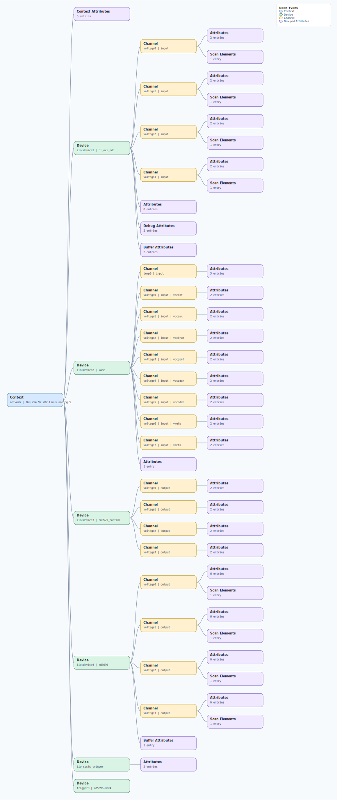

.. This file is auto-generated by doc/gen_emu_xml_trees.py.
   Do not edit manually.

Emulation Context: cn0579.xml
=============================

Source XML: ``test/emu/devices/cn0579.xml``

Diagram
-------

.. Note:: The diagram intentionally groups large attribute lists to keep
   the structure readable.

Text Preview
------------

.. code-block:: text

   context name=network description=169.254.92.202 Linux analog 5.10.0-98748-gbbbac949ef39 #11 SMP PREEMPT Fri May 12 07:19:20 EEST 2023 armv7l
   |-- context-attribute name=hdl_system_id value=[cn0579] [sys rom custom string placeholder] on [coraz7s] git branch [cn0579_dev] git [d696cc11d626051df59bd8a216d106a36a2139ba] clean [2023-01-11 07:59:59] UTC
   |-- context-attribute name=hw_carrier value=Zynq Cora Z7 Development Board
   |-- context-attribute name=ip,ip-addr value=169.254.92.202
   |-- context-attribute name=local,kernel value=5.10.0-98748-gbbbac949ef39
   |-- context-attribute name=uri value=ip:169.254.92.202
   |-- device id=iio:device1 name=cf_axi_adc
   |   |-- channel id=voltage0 type=input
   |   |   |-- scan-element index=0 format=le:s24/32>>0 scale=0.000488
   |   |   |-- attribute name=label filename=in_voltage0_label value=ERROR
   |   |   `-- attribute name=scale filename=in_voltage_scale value=0.000488281
   |   |-- channel id=voltage1 type=input
   |   |   |-- scan-element index=1 format=le:s24/32>>0 scale=0.000488
   |   |   |-- attribute name=label filename=in_voltage1_label value=ERROR
   |   |   `-- attribute name=scale filename=in_voltage_scale value=0.000488281
   |   |-- channel id=voltage2 type=input
   |   |   |-- scan-element index=2 format=le:s24/32>>0 scale=0.000488
   |   |   |-- attribute name=label filename=in_voltage2_label value=ERROR
   |   |   `-- attribute name=scale filename=in_voltage_scale value=0.000488281
   |   |-- channel id=voltage3 type=input
