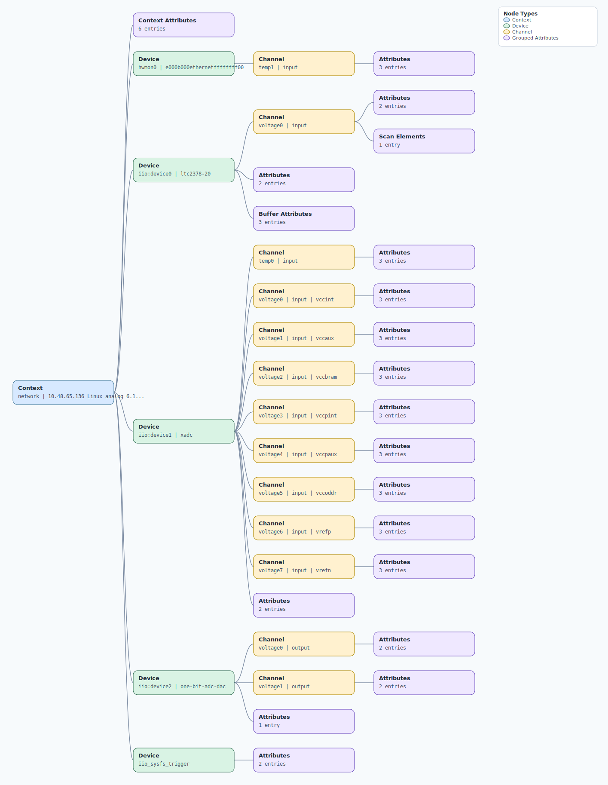

.. This file is auto-generated by doc/gen_emu_xml_trees.py.
   Do not edit manually.

Emulation Context: ltc2378.xml
==============================

Source XML: ``test/emu/devices/ltc2378.xml``

Diagram
-------

.. Note:: The diagram intentionally groups large attribute lists to keep
   the structure readable.

Text Preview
------------

.. code-block:: text

   context name=network description=10.48.65.136 Linux analog 6.12.0-26878-g8bd12ffb8f43 #276 SMP PREEMPT Wed Nov 19 13:46:04 EET 2025 armv7l
   |-- context-attribute name=hdl_system_id value=[ada4355_fmc] [BUFMRCE_EN] on [zed] git branch [ada4355_xdc_update] git [5781fd85b80b06cce0cd608f0440a30fd11cabb4] dirty [2025-08-13 05:58:27] UTC
   |-- context-attribute name=hw_carrier value=Xilinx Zynq ZED
   |-- context-attribute name=hw_model value=EVAL-ADAQ3130FMC1Z on Xilinx Zynq ZED
   |-- context-attribute name=ip,ip-addr value=10.48.65.136
   |-- context-attribute name=local,kernel value=6.12.0-26878-g8bd12ffb8f43
   |-- context-attribute name=uri value=ip:10.48.65.136
   |-- device id=hwmon0 name=e000b000ethernetffffffff00
   |   `-- channel id=temp1 type=input
   |       |-- attribute name=crit filename=temp1_crit value=100000
   |       |-- attribute name=input filename=temp1_input value=31000
   |       `-- attribute name=max_alarm filename=temp1_max_alarm value=0
   |-- device id=iio:device0 name=ltc2378-20
   |   |-- channel id=voltage0 type=input
   |   |   |-- scan-element index=0 format=le:s20/32>>0 scale=0.009537
   |   |   |-- attribute name=raw filename=in_voltage0_raw value=-249376
   |   |   `-- attribute name=scale filename=in_voltage0_scale value=0.009536743
   |   |-- attribute name=sampling_frequency value=500000
   |   |-- attribute name=waiting_for_supplier value=0
   |   |-- buffer-attribute name=data_available value=0
