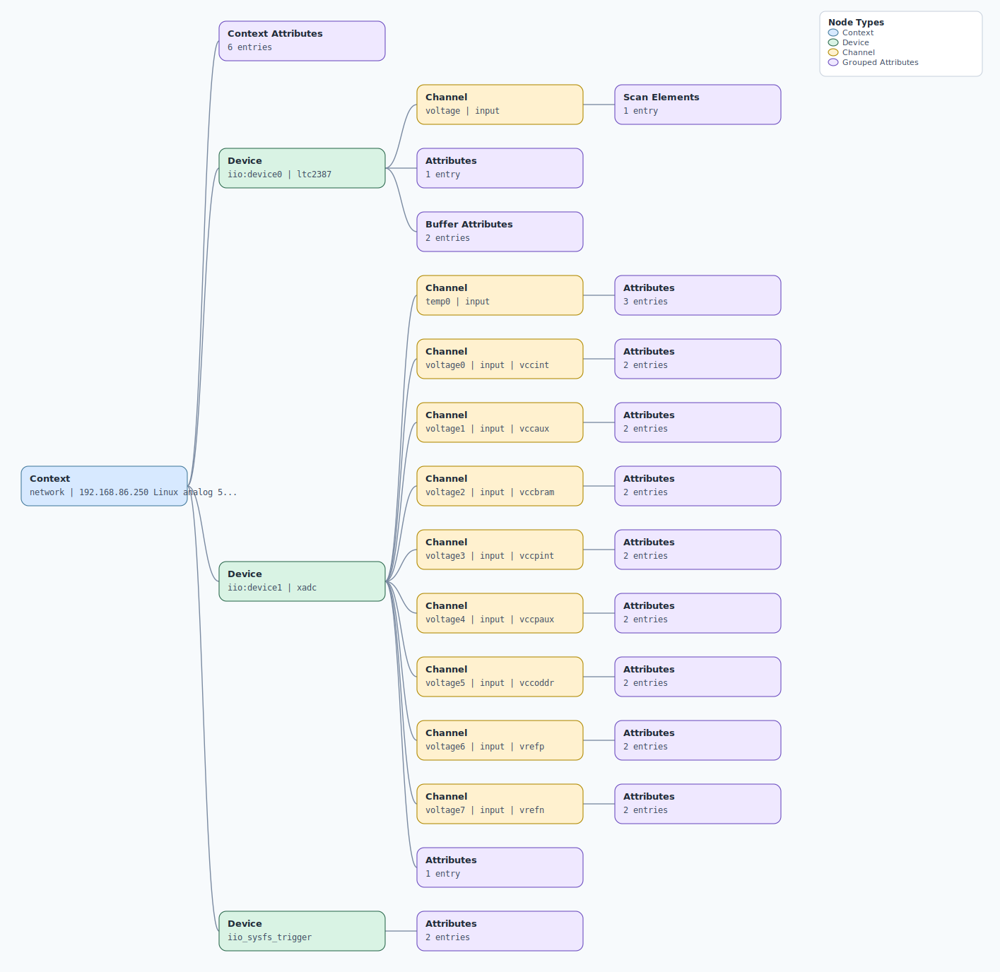

.. This file is auto-generated by doc/gen_emu_xml_trees.py.
   Do not edit manually.

Emulation Context: ltc2387.xml
==============================

Source XML: ``test/emu/devices/ltc2387.xml``

Diagram
-------

.. Note:: The diagram intentionally groups large attribute lists to keep
   the structure readable.

Text Preview
------------

.. code-block:: text

   context name=network description=192.168.86.250 Linux analog 5.10.0-98024-gad86e9b3d317-dirty #46 SMP PREEMPT Thu Mar 3 17:57:26 EET 2022 armv7l
   |-- context-attribute name=hdl_system_id value=[cn0577] [sys rom custom string placeholder] on [zed] git branch [ltc2387_init2] git [87d3fbdb437e88ad0d226e235bbb89deff60e2df] clean [2022-02-08 08:22:55] UTC
   |-- context-attribute name=hw_carrier value=Xilinx Zynq ZED
   |-- context-attribute name=hw_model value=on Xilinx Zynq ZED
   |-- context-attribute name=ip,ip-addr value=192.168.86.250
   |-- context-attribute name=local,kernel value=5.10.0-98024-gad86e9b3d317-dirty
   |-- context-attribute name=uri value=ip:analog.local
   |-- device id=iio:device0 name=ltc2387
   |   |-- channel id=voltage type=input
   |   |   `-- scan-element index=0 format=le:s18/32>>0
   |   |-- attribute name=sampling_frequency value=15000000
   |   |-- buffer-attribute name=data_available value=0
   |   `-- buffer-attribute name=length_align_bytes value=8
   |-- device id=iio:device1 name=xadc
   |   |-- channel id=temp0 type=input
   |   |   |-- attribute name=offset filename=in_temp0_offset value=-2219
   |   |   |-- attribute name=raw filename=in_temp0_raw value=2573
   |   |   `-- attribute name=scale filename=in_temp0_scale value=123.040771484
   |   |-- channel id=voltage0 type=input name=vccint
   |   |   |-- attribute name=raw filename=in_voltage0_vccint_raw value=1343
