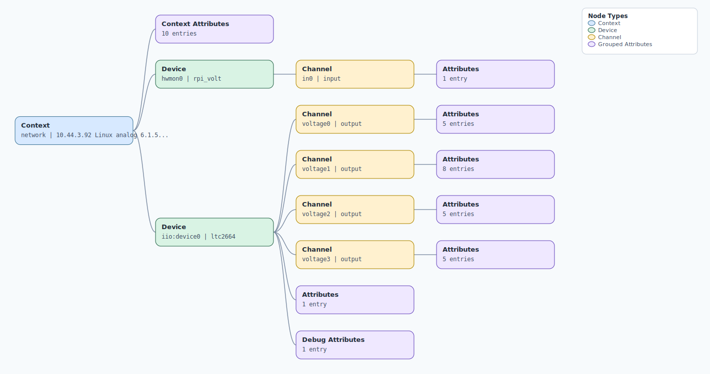

.. This file is auto-generated by doc/gen_emu_xml_trees.py.
   Do not edit manually.

Emulation Context: ltc2664.xml
==============================

Source XML: ``test/emu/devices/ltc2664.xml``

Diagram
-------

.. Note:: The diagram intentionally groups large attribute lists to keep
   the structure readable.

Text Preview
------------

.. code-block:: text

   context name=network description=10.44.3.92 Linux analog 6.1.54-v7l+ #3472 SMP Thu Jan 25 16:22:37 CET 2024 armv7l
   |-- context-attribute name=dtoverlay value=rpi-ltc2664,vc4-kms-v3d
   |-- context-attribute name=hw_carrier value=Raspberry Pi 4 Model B Rev 1.4
   |-- context-attribute name=hw_mezzanine value=0x0001
   |-- context-attribute name=hw_model value=0x0001 on Raspberry Pi 4 Model B Rev 1.4
   |-- context-attribute name=hw_name value=PMD-RPI-INTZ
   |-- context-attribute name=hw_serial value=13837e96-186d-45af-ac0b-e252c8d49a78
   |-- context-attribute name=hw_vendor value=Analog Devices, Inc.
   |-- context-attribute name=ip,ip-addr value=10.44.3.92
   |-- context-attribute name=local,kernel value=6.1.54-v7l+
   |-- context-attribute name=uri value=ip:analog.local
   |-- device id=hwmon0 name=rpi_volt
   |   `-- channel id=in0 type=input
   |       `-- attribute name=lcrit_alarm filename=in0_lcrit_alarm value=0
   `-- device id=iio:device0 name=ltc2664
       |-- channel id=voltage0 type=output
       |   |-- attribute name=offset filename=out_voltage0_offset value=-32768
       |   |-- attribute name=powerdown filename=out_voltage0_powerdown value=1
       |   |-- attribute name=raw filename=out_voltage0_raw value=65208
       |   |-- attribute name=raw_available filename=out_voltage0_raw_available value=[0 1 65535]
