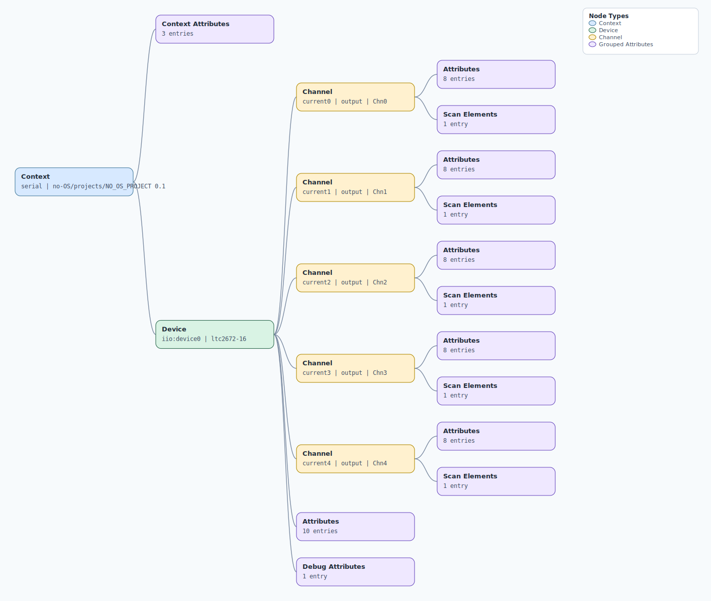

.. This file is auto-generated by doc/gen_emu_xml_trees.py.
   Do not edit manually.

Emulation Context: ltc2672.xml
==============================

Source XML: ``test/emu/devices/ltc2672.xml``

Diagram
-------

.. Note:: The diagram intentionally groups large attribute lists to keep
   the structure readable.

Text Preview
------------

.. code-block:: text

   context name=serial description=no-OS/projects/NO_OS_PROJECT 0.1
   |-- context-attribute name=serial,description value=ttyS0
   |-- context-attribute name=serial,port value=/dev/ttyS0
   |-- context-attribute name=uri value=serial:/dev/ttyS0,230400,8n1n
   `-- device id=iio:device0 name=ltc2672-16
       |-- channel id=current0 type=output name=Chn0
       |   |-- scan-element index=0 format=le:U16/16>>0
       |   |-- attribute name=current filename=out_current0_current value=0.0000mA
       |   |-- attribute name=offset filename=out_current0_offset value=0
       |   |-- attribute name=powerdown filename=out_current0_powerdown value=powerdown
       |   |-- attribute name=powerdown_available filename=out_current0_powerdown_available value=powerdown
       |   |-- attribute name=raw filename=out_current0_raw value=0
       |   |-- attribute name=scale filename=out_current0_scale value=0.0000000000
       |   |-- attribute name=span filename=out_current0_span value=off_mode
       |   `-- attribute name=span_available filename=out_current0_span_available value=off_mode 3.125mA 6.25mA 12.5mA 25mA 50mA 100mA 200mA MVREF 300mA
       |-- channel id=current1 type=output name=Chn1
       |   |-- scan-element index=1 format=le:U16/16>>0
       |   |-- attribute name=current filename=out_current1_current value=0.0000mA
       |   |-- attribute name=offset filename=out_current1_offset value=0
       |   |-- attribute name=powerdown filename=out_current1_powerdown value=powerdown
