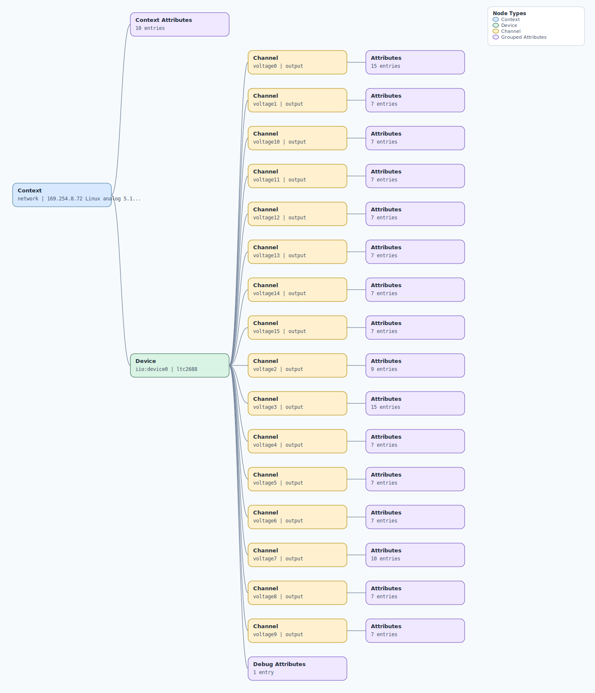

.. This file is auto-generated by doc/gen_emu_xml_trees.py.
   Do not edit manually.

Emulation Context: ltc2688.xml
==============================

Source XML: ``test/emu/devices/ltc2688.xml``

Diagram
-------

.. Note:: The diagram intentionally groups large attribute lists to keep
   the structure readable.

Text Preview
------------

.. code-block:: text

   context name=network description=169.254.8.72 Linux analog 5.10.63-v7l+ #1 SMP Fri Feb 17 13:39:44 +08 2023 armv7l
   |-- context-attribute name=dtoverlay value=vc4-kms-v3d,rpi-ltc2688
   |-- context-attribute name=hw_carrier value=Raspberry Pi 4 Model B Rev 1.1
   |-- context-attribute name=hw_mezzanine value=0x0554
   |-- context-attribute name=hw_model value=0x0554 on Raspberry Pi 4 Model B Rev 1.1
   |-- context-attribute name=hw_name value=EVAL-CN0554-RPIZ
   |-- context-attribute name=hw_serial value=a9e4a91c-b41c-470d-aa47-d92e91299d0e
   |-- context-attribute name=hw_vendor value=Analog Devices, Inc.
   |-- context-attribute name=ip,ip-addr value=169.254.8.72
   |-- context-attribute name=local,kernel value=5.10.63-v7l+
   |-- context-attribute name=uri value=ip:analog.local
   `-- device id=iio:device0 name=ltc2688
       |-- channel id=voltage0 type=output
       |   |-- attribute name=calibbias filename=out_voltage0_calibbias value=0
       |   |-- attribute name=calibscale filename=out_voltage0_calibscale value=0
       |   |-- attribute name=dither_en filename=out_voltage0_dither_en value=0
       |   |-- attribute name=dither_frequency filename=out_voltage0_dither_frequency value=32768
       |   |-- attribute name=dither_frequency_available filename=out_voltage0_dither_frequency_available value=32768 16384 8192 4096 2048
       |   |-- attribute name=dither_offset filename=out_voltage0_dither_offset value=0
       |   |-- attribute name=dither_phase filename=out_voltage0_dither_phase value=0
